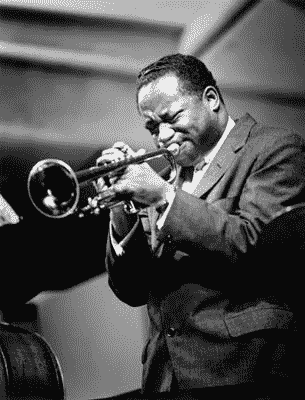

<!--yml
category: 未分类
date: 2024-05-18 15:51:55
-->

# VIX and More: CNBC Million Dollar Portfolio Challenge Update

> 来源：[http://vixandmore.blogspot.com/2007/03/cnbc-million-dollar-portfolio-challenge.html#0001-01-01](http://vixandmore.blogspot.com/2007/03/cnbc-million-dollar-portfolio-challenge.html#0001-01-01)

I am happy to report that as of last night, I am now in the top 1% in the [CNBC Million Dollar Portfolio Challenge](http://vixandmore.blogspot.com/search/label/CNBC%20Million%20Dollar%20Portfolio%20Challenge) at #4577 out of what appears to be about a half million participants.

I was going to keep this news under wraps until the weekend, but since I like to call market tops a little early, I thought I'd share the news today in the event my position starts to 'correct' a little.

Briefly, energy and copper stocks have helped propel me to my current standing and I am heavily weighted in oil, gas and uranium at the moment. In most stock contests, it pays to take ridiculous risks in hopes of lucking into a triple digit return. I have not yet succumbed to that temptation. Instead, making largely incremental gains here and there, I am up 27%. As long as I continue to outperform the market and move up the leader board, I will not be putting all my chips on my favorite number -- until perhaps the last 2-3 weeks of the competition.

For those who may be interested, the photo to the left is of [Clifford Brown](http://en.wikipedia.org/wiki/Clifford_Brown), one of my favorite trumpet players. I figured that if I were going to toot my own horn, I should also acknowledge the work of a true master, who, sadly, had so little time to dazzle us with his talent.

Update: According the [Portfolio Challenge blog](http://www.cnbc.com/id/17506588/), the top ten contestants are already sitting on 100% gains, so I may have to rethink my strategy sooner rather than later...