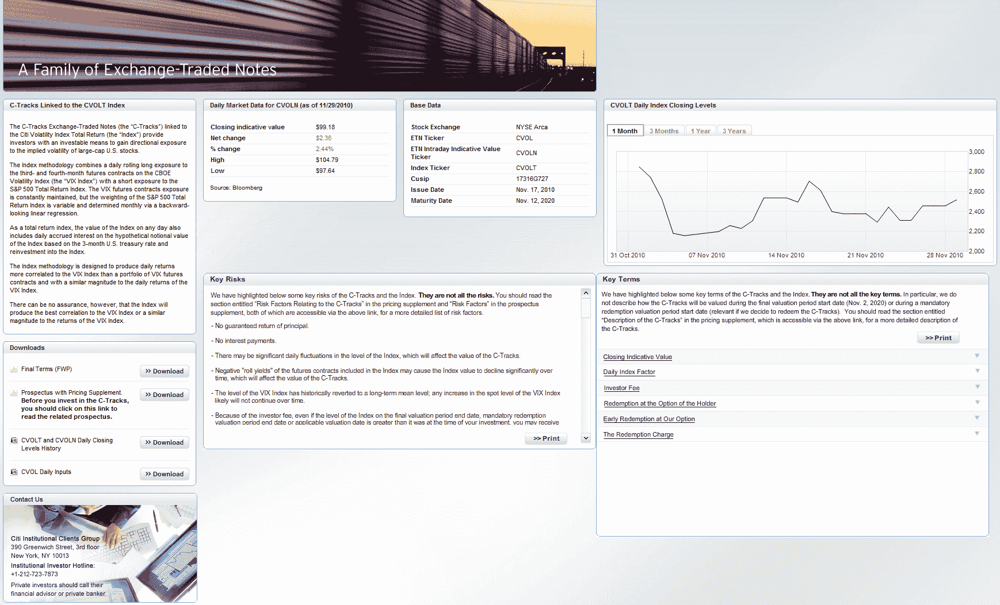

<!--yml
category: 未分类
date: 2024-05-18 16:57:46
-->

# VIX and More: CVOL Steps It Up

> 来源：[http://vixandmore.blogspot.com/2010/11/cvol-steps-it-up.html#0001-01-01](http://vixandmore.blogspot.com/2010/11/cvol-steps-it-up.html#0001-01-01)

In [Citigroup Belly-Flops into the ETP Sponsor Pool](http://seekingalpha.com/article/237822-citigroup-belly-flops-into-etp-sponsor-pool), Ron Rowland had some harsh criticism for Citigroup seemingly stealth launch of the C-Tracks ETN on CVOL ([CVOL](http://vixandmore.blogspot.com/search/label/CVOL)) earlier this month.

I am glad to report that Citigroup now has a [nifty new web site](http://www.c-tracksetns.com/) devoted to CVOL (see graphic below) that includes the prospectus, historical closing prices, a list of the factors and values that are inputs into the CVOL daily calculation (nice!) as well as a description of key risks and key terms and an attractive little charting module. In other words, Citigroup has stepped up to the plate in a big way here.

…and I’m excited that they have done so because I think CVOL has a great deal of potential. I will get into this in more detail in future posts, but essentially this ETN has chosen a much flatter part of the [VIX futures](http://vixandmore.blogspot.com/search/label/VIX%20futures) [term structure](http://vixandmore.blogspot.com/search/label/term%20structure) than [VXX](http://vixandmore.blogspot.com/search/label/VXX) and is using 2x leverage to account for the fact that in the 3-4 month VIX futures maturities, volatility tends to move more gradually on a day to day basis than it does in the cash/spot VIX or in the front month VIX futures. Eventually, I think investors will warm up to this tradeoff, but until CVOL has a sufficient track record to convince some investors that in some respects CVOL has some advantages to VXX, I would expect adoption to be gradual.

So far the volume in CVOL has been low and the spreads have been very wide (often as high as 1%), but as soon as these spreads start to narrow and volume picks up, I expect to be an active trader in CVOL.

Related posts:

*[graphic: Citigroup]*

***Disclosure(s):*** *short VXX at time of writing*