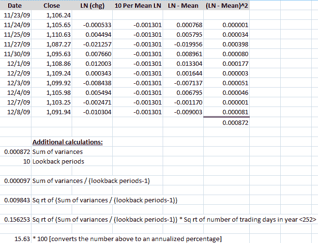
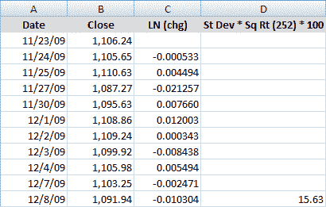

<!--yml
category: 未分类
date: 2024-05-18 17:20:44
-->

# VIX and More: Calculating Centered and Non-centered Historical Volatility

> 来源：[http://vixandmore.blogspot.com/2009/12/calculating-centered-and-non-centered.html#0001-01-01](http://vixandmore.blogspot.com/2009/12/calculating-centered-and-non-centered.html#0001-01-01)

Yesterday in [What Is Historical Volatility?](http://vixandmore.blogspot.com/2009/12/what-is-historical-volatility.html) I attempted to provide a brief overview of [historical volatility](http://vixandmore.blogspot.com/search/label/historical%20volatility) (HV) and put it in a broader volatility context.

Today I will endeavor to address the most frequent question I get about historical volatility: exactly how is it calculated?

You would think the calculation would be a straightforward affair, but this is not necessarily the case. As best I can in plain English (and since I have not mastered Word’s equation editor), the steps for calculating historical volatility are as follows:

1.  Select a desired lookback period in trading days *(lookback period)*
2.  Gather closing prices for the full lookback period, plus one additional day *(lookback +1)*
3.  Calculate the daily close-to-close price changes in a security for each day in the lookback period *(daily change)*
4.  Determine the natural log of each daily percentage change *(log of daily changes)*
5.  Calculate the mean of all the natural logs of the closing prices for the lookback period *(log lookback mean)*
6.  For each day, subtract the lookback mean from the log of daily changes *(daily difference)*
7.  Square all the differences between the mean and the daily change *(daily variance)*
8.  Sum all the squares of the differences *(sum of variances)*
9.  Divide the sum of the squares of the variances by the lookback period *(lookback variance)*
10.  Take the square root of the lookback variance *(historical volatility, expressed as a standard deviation)*

 *Finally, to convert the standard deviation into an annual volatility percentage take the HV expressed as a standard deviation and multiply it by the square root of the number of trading days in a year (approximately 252) and then by 100 *(historical volatility).*

An Excel example will help to illustrate the steps and calculations. The table below uses closing data for the SPX for the last eleven trading sessions. The second row has a date of 11/24/09 in column A, a close of 1105.65 in column B and the natural log of the close for 11/24 divided by 11/23 in the column C [=LN (b3:b2)]. Column D is an average of the natural logs in column C [=average (c3:c12)], while column E simply subtracts column D from column C [=c3-d3]. Finally, Column F squares the results of column E [=e3^2] and cell F13 sums all the squares [=sum(f3:f12)].

The calculations below the main table start by repeating the value of F13 in A16 [=f13] and stating the number of lookback periods in A17\. In A19, A16 is divided by A17 [=a16/a17]. A21 then takes the square root of the result from A19 [=a19^1/2]. A23 takes the result from A21 and multiplies it by the square root of 252 [=a21*sqrt(252)]. Last but not least, A25 converts to result from A23 to a percentage [=a23*100], yielding a 10-day historical volatility of 15.63.

To replicate the entire table, the formulas from row 3 can just be copied down to the bottom of the table, with one exception. That exception is column D, where the mean value – not the formula – is repeated throughout the table.

If this seems like a lot of calculations to arrive at historical volatility value, there is a much shorter and slightly different way – and one that I believe generates a better number for traders.

The above calculations reflect a centered approach in which daily price changes are characterized relative to a mean value for the entire period. Another way to look at the same problem is to assume that in the long run, the mean change in price approaches zero and is not meaningful. As a corollary, if the mean is not meaningful, there is no reason to subtract it from the daily changes, so all the calculations involving the mean can be dropped. This is the non-centered approach to calculating historical volatility and is sometimes known as “ditching the mean”.

The resulting table below is much more manageable and easier to follow. The first three columns (date, close and natural log of the daily price change) are identical to those above. The fourth column simply takes the standard deviation of the natural log of the daily price changes, multiplies it by the square root of the number of trading days in a year (252) and coverts it to an annualized volatility percentage by multiplying by 100\. As a consequence, the formula in cell d12 below is simply =stdev(c3:c12)*sqrt(252)*100\. This formula can now be copied to the rows below to calculate subsequent historical volatility values. Note that unlike the centered approach, there are no additional calculations required beyond those in the main table.

Here the non-centered approach also yields a 10-day historical volatility of 15.63.

For the next part in this series, I will expand upon what some of the formulas mean, how they can be modified, and why traders might prefer the non-centered historical volatility data to the centered historical volatility data.

For more on historical volatility, readers are encouraged to check out:

 ****Disclosure:*** *none***