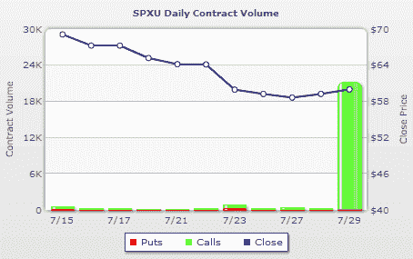

<!--yml
category: 未分类
date: 2024-05-18 17:36:18
-->

# VIX and More: Call Volume Spikes in SPXU

> 来源：[http://vixandmore.blogspot.com/2009/07/call-volume-spikes-in-spxu.html#0001-01-01](http://vixandmore.blogspot.com/2009/07/call-volume-spikes-in-spxu.html#0001-01-01)

Since my ongoing discussion of [SPXU](http://vixandmore.blogspot.com/search/label/SPXU) seems to have generated considerable interest in the SPX pair of [triple ETFs](http://vixandmore.blogspot.com/search/label/triple%20ETFs) (SPXU is the -3x ETF and [UPRO](http://vixandmore.blogspot.com/search/label/UPRO) is the +3x ETF), I thought this morning’s surge in call activity in SPXU should be noted.

As the chart below from [WhatsTrading.com](http://whatstrading.com/) shows, the 20,000+ calls traded in SPXU during the first two hours of trading suggests some large bets on the SPX are now making their way into the triple ETF options arena. This should come as no surprise, as my recent [Triple ETF Options Landscape](http://vixandmore.blogspot.com/2009/07/triple-etf-options-landscape.html) confirmed large volumes of options trading in several triple ETF pairs, including financials ([FAS](http://vixandmore.blogspot.com/search/label/FAS) and [FAZ](http://vixandmore.blogspot.com/search/label/FAZ)), small caps ([TNA](http://vixandmore.blogspot.com/search/label/TNA) and [TZA](http://vixandmore.blogspot.com/search/label/TZA)), large caps ([BGU](http://vixandmore.blogspot.com/search/label/BGU) and [BGZ](http://vixandmore.blogspot.com/search/label/BGZ)) and emerging markets ([EDC](http://vixandmore.blogspot.com/search/label/EDC) and [EDZ](http://vixandmore.blogspot.com/search/label/EDZ).)

Today’s big SPXU transaction was for 20,961 December 75 calls, which appear to have been transacted at the ask price, suggesting some buying interest in the -3x ETF.

Whether this transaction is a speculative play or of the hedging variety cannot be determined, but given all the issues associated with price decay due to compounding, I find it interesting that the options are five months out.

*[source: WhatsTrading.com]*

***Disclosure****: Long SPXU at time of writing.*