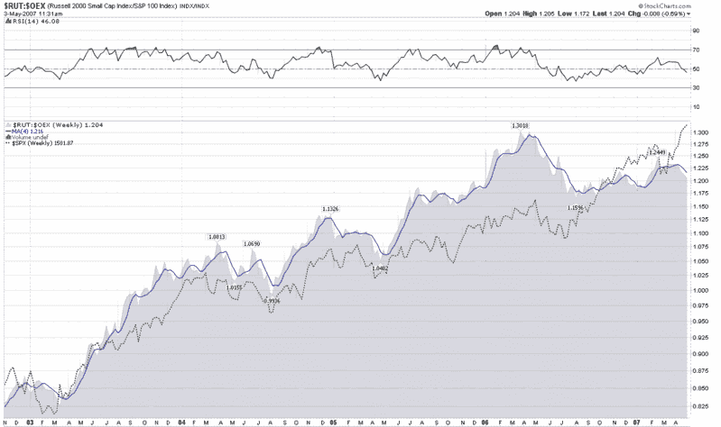

<!--yml
category: 未分类
date: 2024-05-18 15:46:16
-->

# VIX and More: Capitalization and Bullishness

> 来源：[http://vixandmore.blogspot.com/2007/05/capitalization-and-bullishness.html#0001-01-01](http://vixandmore.blogspot.com/2007/05/capitalization-and-bullishness.html#0001-01-01)

An unusual aspect of the post-[2/27](http://vixandmore.blogspot.com/search/label/February%2027) rebound in the markets has been the ascendancy of large cap stocks over smaller capitalization ones.  While there have been many periods in which large caps have outperformed small caps, in our current 4 ½ year bull market, this has *never* coincided with a dramatic up leg in the S&P 500, as the ratio chart for the Russell 2000 and the S&P 100 demonstrates below (click for a larger image):

If you turn back the clock to the 1990s, however, you discover that there is an important precedent for large cap outperformance leading the broader markets up.  Specifically, the period of 1995-1999 saw the [OEX](http://www2.standardandpoors.com/portal/site/sp/en/us/page.topic/indices_100/2,3,2,2,0,0,0,0,0,0,0,0,0,0,0,0.html) dramatically outperform the [RUT](http://www.russell.com/indexes/characteristics_fact_sheets/US/Russell_2000_Index.asp) in relative terms, dragging the broader markets through a bull run that none of us will ever forget.

The 1995-1999 period is also a very interesting one from a VIX perspective (yes, it’s always about the VIX, isn’t it?) because it coincides with the one long-term bull market in which volatility and stocks moved up hand in hand, as I discussed at some length two weeks ago in “[The SPX and the VIX Revisited](http://vixandmore.blogspot.com/2007/04/spx-and-vix-revisited.html).”  (Incidentally, given the strong response to that post, I have moved it to the select “Archive Highlights” section in the right hand column of the blog.)

With every ‘discovery’ comes more questions and the question this observation has raised for me is the relationship between volatility and the relative performance of different capitalization groups.  Stay tuned…