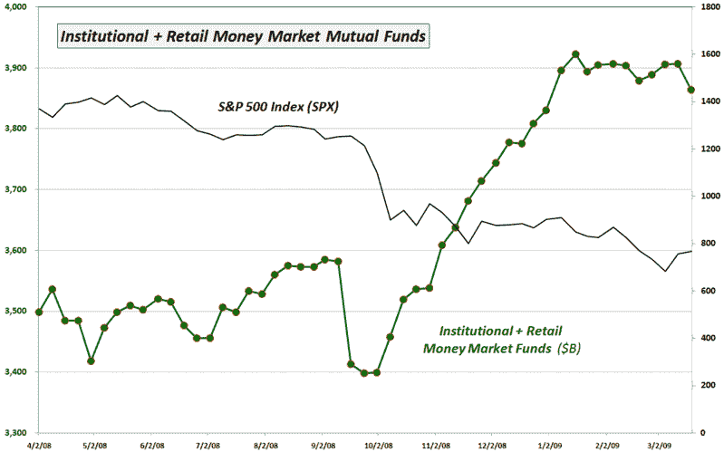

<!--yml
category: 未分类
date: 2024-05-18 17:54:25
-->

# VIX and More: Cash on the Sidelines Headed Back to Stocks?

> 来源：[http://vixandmore.blogspot.com/2009/03/cash-on-sidelines-headed-back-to-stocks.html#0001-01-01](http://vixandmore.blogspot.com/2009/03/cash-on-sidelines-headed-back-to-stocks.html#0001-01-01)

Two months ago, in [Chart of the Week: Change of Trends in Cash Holdings?](http://vixandmore.blogspot.com/2009/01/chart-of-week-change-of-trend-in-cash.html) I posted a chart based on money market mutual fund cash levels as calculated by the Investment Company Institute’s (ICI) that generated a considerable amount of discussion when I concluded that the chart may be pointing to a topping trend for [cash on the sidelines](http://vixandmore.blogspot.com/search/label/cash%20on%20the%20sidelines).

Fast forward to the present and as the updated version of the same chart shows, the mid-January drop in money market mutual fund cash levels turns out to indeed have been the beginning of a change in trend, at least according to the ICI data.

In fact, last week’s data, which cuts off on Wednesday, shows the largest drop in money market mutual fund cash levels in over six months.

With rates on money markets and bonds both headed lower, I would not be surprised to see more money flowing back into stocks for the simple reason that alternative investments have become less attractive.

*[source: Investment Company Institute, VIX and More]*