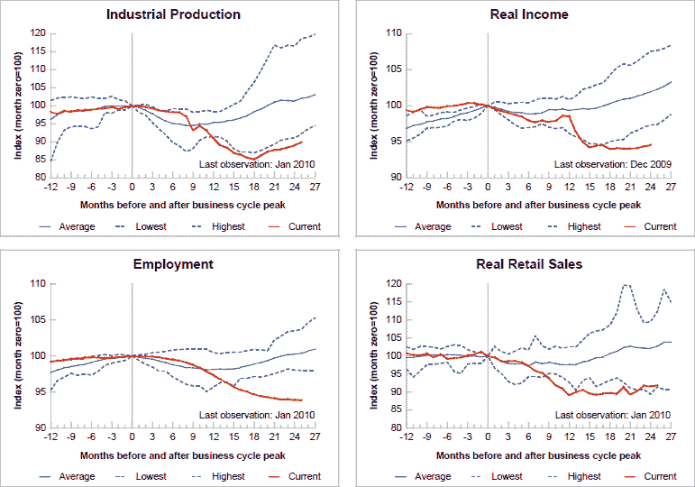

<!--yml
category: 未分类
date: 2024-05-18 17:15:15
-->

# VIX and More: Chart of the Week: A Broader Look at the U.S. Economic Recovery

> 来源：[http://vixandmore.blogspot.com/2010/02/chart-of-week-broader-look-at-us.html#0001-01-01](http://vixandmore.blogspot.com/2010/02/chart-of-week-broader-look-at-us.html#0001-01-01)

Last week, in [Chart of the Week: Retail Sales Recovering](http://vixandmore.blogspot.com/2010/02/chart-of-week-retail-sales-recovering.html), I attempted to demonstrate that the much beleaguered U.S. consumer has actually been a relative source of strength during the economic recovery.

In this week’s [chart of the week](http://vixandmore.blogspot.com/search/label/chart%20of%20the%20week), my goal is to expand that relatively narrow view of economic activity to encompass four key recession indicators that cut across a broad scope of economic activity: [industrial production](http://vixandmore.blogspot.com/search/label/industrial%20production); income; employment; and [retail sales](http://vixandmore.blogspot.com/search/label/retail%20sales).

Note that relative to previous recoveries, which typically follow a bottom that comes some 8-12 months after the top, the current recovery is by far the weakest in the 62 years of data for employment and real income. Industrial production has shown the sharpest rebound, but is still the weakest bounce in 62 years. The only one of the four indicators that is above the historical low is retail sales – yet even here the margin is a narrow one.

The rather simplified question suggested by this data puzzle is whether retail sales and industrial production will pull incomes and employment up or whether weak employment and income trends will drag down retail sales and industrial production.

For comparison purposes, it may be interesting to look at a chart of the [same data as of eight months ago](http://vixandmore.blogspot.com/2009/06/chart-of-week-four-key-economic.html).

For more on related subjects, readers are encouraged to check out:

*[source: Federal Reserve Bank of St. Louis]* 

***Disclosures:*** *none*