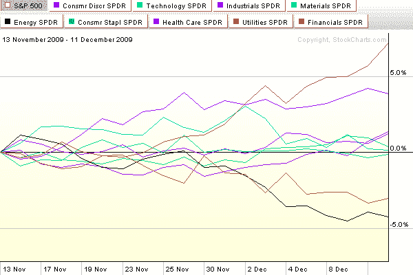

<!--yml
category: 未分类
date: 2024-05-18 17:20:12
-->

# VIX and More: Chart of the Week: A Month of New Sector Leadership

> 来源：[http://vixandmore.blogspot.com/2009/12/chart-of-week-month-of-new-sector.html#0001-01-01](http://vixandmore.blogspot.com/2009/12/chart-of-week-month-of-new-sector.html#0001-01-01)

During the course of the past month or two, stocks have drifted sideways, lacking buying conviction and strong leadership.

In this week’s [chart of the week](http://vixandmore.blogspot.com/search/label/chart%20of%20the%20week) below, I have tracked the performance of the nine AMEX [sector](http://vixandmore.blogspot.com/search/label/sectors) [SPDR](http://vixandmore.blogspot.com/search/label/SPDRs)s over the course of the past month. Note that former leaders financials ([XLF](http://vixandmore.blogspot.com/search/label/XLF)) and energy ([XLE](http://vixandmore.blogspot.com/search/label/XLE)) are now lagging, while defensive sectors such as utilities ([XLU](http://vixandmore.blogspot.com/search/label/XLU)) and health care ([XLV](http://vixandmore.blogspot.com/search/label/XLV)) are leading the way. Now I have nothing against utilities and health care, but the next time these two sectors lead a significant bull rally will be the first time in my memory. One or more of technology ([XLK](http://vixandmore.blogspot.com/search/label/XLK)), consumer discretionary ([XLY](http://vixandmore.blogspot.com/search/label/XLY)), materials ([XLB](http://vixandmore.blogspot.com/search/label/XLB)) or perhaps financials needs to take a leadership role to give the next bullish leg the type of strength that portfolio managers can believe in.

A good defense may win championship, but it will not light a fire under potential buyers.

For more on related subjects, readers are encouraged to check out:

 **[source: StockCharts]*

 ****Disclosure:*** *none***