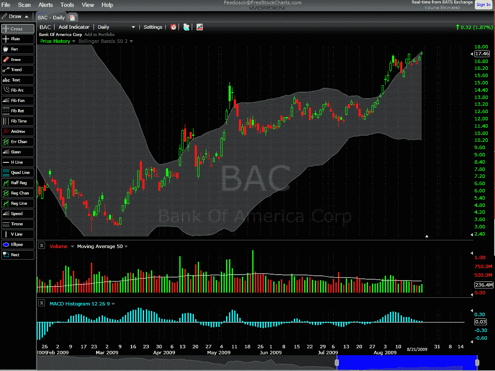

<!--yml
category: 未分类
date: 2024-05-18 17:32:22
-->

# VIX and More: Chart of the Week: BAC Through the Eyes of FreeStockCharts.com

> 来源：[http://vixandmore.blogspot.com/2009/08/chart-of-week-bac-through-eyes-of.html#0001-01-01](http://vixandmore.blogspot.com/2009/08/chart-of-week-bac-through-eyes-of.html#0001-01-01)

It has been almost six months since I have mentioned banks in the [chart of the week](http://vixandmore.blogspot.com/search/label/chart%20of%20the%20week), the so it seems as if the statute of limitations for beating dead horses has probably passed and I can talk about Bank of America ([BAC](http://vixandmore.blogspot.com/search/label/BAC)) once again.

In the past few weeks, many traders have taken to using Bank of America as their market weather vane, reasoning that as Bank of America goes, so go the banks and as the banks go, so go stocks in general. For the most part, this rationale has held up and anyone who has used Bank of America to gauge the direction of the markets has likely done quite nicely. Of course, investors who were fortunate to have grabbed some BAC shares when the stock was trading below 4.00 have now seen their original investment turn into a five-bagger in just five months.

The chart below also marks the first time I have used a chart from [FreeStocksCharts.com](http://www.freestockcharts.com/) on the blog. This relatively new web site is a [Worden Brothers](http://www.worden.com/) venture – which means that it comes from the same people behind the popular TeleChart charting program. Another Worden Brothers product is [StockFinder](http://www.stockfinder.com/assets/StockFinder%204.0%20At%20a%20Glance.pdf) and if you are familiar with StockFinder, then you already know FreeStockCharts.com, which resembles an online incarnation of the former. In the graphic, I have captured some of the drawing tools (which include some fairly exotic tools), available at FreeStockCharts.com. There are also 52 customizable indicators (again, not just the basics), an alert function and other features of interest. In one of the great investing oxymorons, there is also a [premium version](https://www.worden.com/Products/FreeStockCharts/Premium) of FreeStockCharts.com, with fees that are competitive with [StockCharts.com](http://stockcharts.com/).

As a StockCharts subsciber, it would take a great deal for me to switch to another charting program, but FreeStockCharts.com certainly looks like a compelling alternative at first blush. At the very least, it can provide a different color scheme and set of indicators for the blog…

For some related posts, try:

*[source: FreeStockCharts.com]*