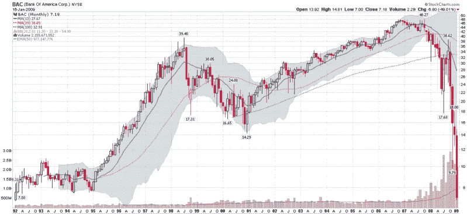

<!--yml
category: 未分类
date: 2024-05-18 18:05:23
-->

# VIX and More: Chart of the Week: Bank of America Teeters

> 来源：[http://vixandmore.blogspot.com/2009/01/chart-of-week-bank-of-america-teeters.html#0001-01-01](http://vixandmore.blogspot.com/2009/01/chart-of-week-bank-of-america-teeters.html#0001-01-01)

It has been a tough week for the banks, but particularly for Bank of America ([BAC](http://vixandmore.blogspot.com/search/label/BAC)), where the company’s recent struggles have earned it a stint in the spotlight as this week’s [chart of the week](http://vixandmore.blogspot.com/search/label/chart%20of%20the%20week).

During the week it was revealed that as a result of an ill-conceived acquisition of Merrill Lynch and other questionable moves, BAC ~~extorted~~ received secretive Treasury funding of $20 billion in addition to guarantees of up to $118 billion for toxic assets.

Bear Stearns and Lehman Brothers had their turn as the [poster child](http://vixandmore.blogspot.com/2008/03/lehman-brothers-leh-bounces.html) for investor indignation, but now Ken Lewis and Bank of America are in danger of trumping some of the excesses of their ancestral whipping boys.

Either U.S. banks are about to reach a bottom…or we are witnessing the fall of the last few banks whose survival as independent entities might be able to prevent the wholesale nationalization of the banking system.

The monthly chart below shows not only the magnitude of the recent declines, but makes the case that in some respects, January has been the worst month yet, at least for Bank of America.

*[source: StockCharts]*