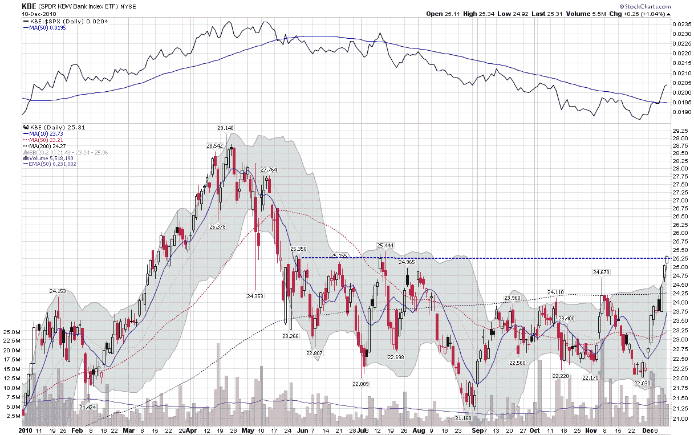

<!--yml
category: 未分类
date: 2024-05-18 16:56:40
-->

# VIX and More: Chart of the Week: Banks on a Tear

> 来源：[http://vixandmore.blogspot.com/2010/12/chart-of-week-banks-on-tear.html#0001-01-01](http://vixandmore.blogspot.com/2010/12/chart-of-week-banks-on-tear.html#0001-01-01)

There were many cross-currents in the financial markets during the last week, but one of the dominant themes was the spike in Treasury yields. As expectations for interest rates move higher, the banks are also catching a bid. Long able to borrow at Bernanke-induced artificially low rates, now banks are finding better prospects on the lending side – and have the added bonus of a larger yield spread on their loans as interest rates start to climb.

These factors make banks the focal point of this week’s [chart of the week](http://vixandmore.blogspot.com/search/label/chart%20of%20the%20week). In the graphic below, note that the upper study shows banks have been consistently underperforming the S&P 500 index for the past seven months. In the last week, however, banks have shown a dramatic turnaround that has lifted [KBE](http://vixandmore.blogspot.com/search/label/KBE), the popular bank ETF, above resistance (dotted blue line) and also reversed the trend of outperforming the broader market.

As was the case in 2010, the performance of the banks will be a critical factor in the performance of the broader market in 2011\. Said another way, banks will continue to be a critical barometer not just of global growth, but of the ability of various economies to deal with threats to growth, such as sovereign debt and other issues.

Related posts:

*[source: StockCharts.com]*

***Disclosure(s):*** *long KBE at time of writing*