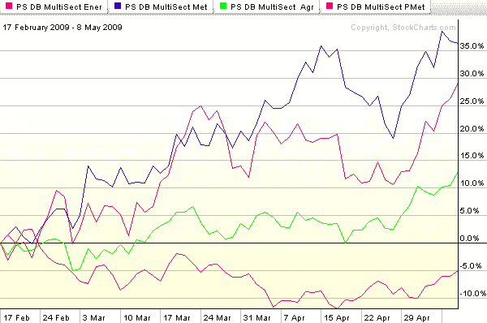

<!--yml
category: 未分类
date: 2024-05-18 17:48:05
-->

# VIX and More: Chart of the Week: Breaking Out Recent Commodities Moves

> 来源：[http://vixandmore.blogspot.com/2009/05/chart-of-week-breaking-out-recent.html#0001-01-01](http://vixandmore.blogspot.com/2009/05/chart-of-week-breaking-out-recent.html#0001-01-01)

This week’s [chart of the week](http://vixandmore.blogspot.com/search/label/chart%20of%20the%20week) looks at [commodities](http://vixandmore.blogspot.com/search/label/commodities), where base metals (blue line) and energy (red line) began to bottom just after the middle of February, about 2 ½ weeks before stocks put in a bottom. Interestingly, agriculture (green line) bottomed on March 2^(nd), just before stocks found their bottom. Precious metals, which marches to the beat of a very different drummer during periods of economic stress, bottomed back on November 12^(th) and made its most recent high on February 23^(rd), just as base metals and energy began to rally.

The chart below captures the action in four commodity sub-sector ETFs since February 17^(th). The chart shows the base metals ETF ([DBB](http://vixandmore.blogspot.com/search/label/DBB)) to be the strongest performer during this period. While DBB has faltered in the past few days, energy ([DBE](http://vixandmore.blogspot.com/search/label/DBE)) has surged. Agriculture ([DBA](http://vixandmore.blogspot.com/search/label/DBA)) has recently joined the bull party and with concerns about rising interest rates heating up, even precious metals ([DBP](http://vixandmore.blogspot.com/search/label/DBP)) have started to rally as well.

It would not surprise me if 3-4 of these commodity sub-sector ETFs outperform the S&P 500 index for the rest of 2009\. At the very least, they could provide some important portfolio diversification and a potential hedge against inflation.

*[source: StockCharts]*

***Disclosure****: Long DBB at time of writing.*