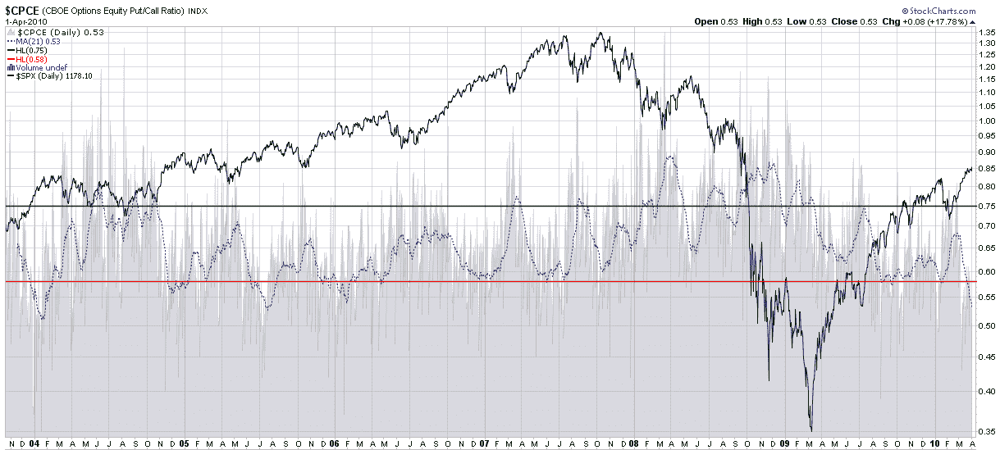

<!--yml
category: 未分类
date: 2024-05-18 17:12:07
-->

# VIX and More: Chart of the Week: CBOE Monthly Equity Put to Call Ratio Nears All-Time Low

> 来源：[http://vixandmore.blogspot.com/2010/04/chart-of-week-cboe-monthly-equity-put.html#0001-01-01](http://vixandmore.blogspot.com/2010/04/chart-of-week-cboe-monthly-equity-put.html#0001-01-01)

For trading purposes, I adhere fairly faithfully to a 10-day exponential moving average (EMA) of the CBOE equity put to call ratio ([CPCE](http://vixandmore.blogspot.com/search/label/CPCE)) as an appropriate smoothing factor to flag short to intermediate-term swing trading opportunities. There are occasions, however, when a longer-term moving average, like a 21-day simple moving average, is a better tool for identifying persistent extremes in put and call activity. This week is one of those occasions.

The [chart of the week](http://vixandmore.blogspot.com/search/label/chart%20of%20the%20week) below looks at the full history of the CBOE equity put to call ratio, which dates from October 21, 2003, and applies a 21-day SMA (dotted blue line) to generate what I call the monthly equity [put to call](http://vixandmore.blogspot.com/search/label/put%20to%20call) ratio. As the chart shows, readings below 0.60 have generally been a good time to take profits on long positions and/or initiate short positions. In fact, the current 0.53 level has only been seen on one prior instance, in January 2004\. That period just happened to be exactly 13 months after the S&P 500 index had bottomed and started a strong bull rally. It also marked the beginning of a period in which stocks declined for ten months, before resuming a rally that would ultimately last until October 2007.

Of course there is nothing magical about low equity put to call ratios or rallies stalling after a 13 month rise, but bulls and bears alike should certainly take note of historical precedent.

For more on related subjects, readers are encouraged to check out:

*[source: StockCharts.com]* 

***Disclosure(s):*** *none*