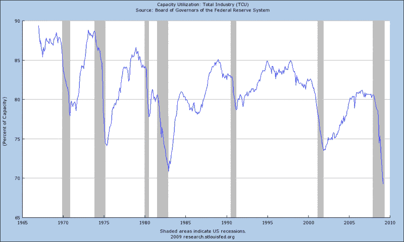

<!--yml
category: 未分类
date: 2024-05-18 17:51:23
-->

# VIX and More: Chart of the Week: Capacity Utilization Sets New Low

> 来源：[http://vixandmore.blogspot.com/2009/04/chart-of-week-capacity-utilization-sets.html#0001-01-01](http://vixandmore.blogspot.com/2009/04/chart-of-week-capacity-utilization-sets.html#0001-01-01)

I have been bullish since March 5^(th) ([SPX at 687; Intermediate Bottom Potential Is High](http://vixandmore.blogspot.com/2009/03/spx-at-687-intermediate-bottom.html)), but a number of factors have turned my bias back to the bearish side in the course of the past few days.

Apart from some technical indicators which suggest equities are overbought at present, there has been a recent wave of economic data, much of it swept under the rug, which suggests that bullish headlines may soon be on the wane. The news spans housing starts to foreclosures to credit card charge-offs to retail sales and industrial production. Frankly, none of it looks promising.

Joined at the hip to the industrial production report is [capacity utilization](http://vixandmore.blogspot.com/search/label/capacity%20utilization) data. Essentially, this statistic measures how much of the national production capacity is being used and how much is sitting idle.

This week’s [chart of the week](http://vixandmore.blogspot.com/search/label/chart%20of%20the%20week) looks at the full history of total capacity utilization in the United States, based on data available from the Federal Reserve. Total capacity utilization for March was just 69.3%. This is the lowest number in the history of this statistical series, which dates back to 1967\. While not shown in the graph below, manufacturing capacity utilization fell to 65.8%, which is the lowest number since records were first gathered in 1948.

In terms of interpreting the capacity utilization data, it is probably best to think of the number as a broad measure of demand relative to existing infrastructure. Of course the current record low numbers reflect a historic weakness in demand. Capacity utilization is also a strong predictor of inflationary and deflationary pressures. With so much slack in the system, deflationary pressures are sure to increase as prices get slashed in order to offset the high fixed costs of so much idle productive capacity.

In addition to the current bad news, there are some complicating factors which may make it difficult to reverse the recent trend. Looking ahead, a stronger dollar and weaker consumer does not bode well for future production data – and should raise new concerns about the possibility of deflation.

Industrial production may steal most of the headlines, but capacity utilization is an often overlooked important piece of the economic puzzle.

*[source: Federal Reserve]*