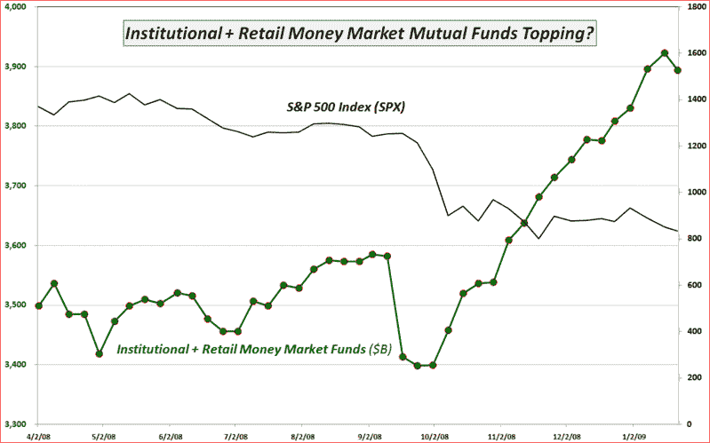

<!--yml
category: 未分类
date: 2024-05-18 18:03:42
-->

# VIX and More: Chart of the Week: Change of Trend in Cash Holdings?

> 来源：[http://vixandmore.blogspot.com/2009/01/chart-of-week-change-of-trend-in-cash.html#0001-01-01](http://vixandmore.blogspot.com/2009/01/chart-of-week-change-of-trend-in-cash.html#0001-01-01)

Tempting though it may be to slap up yet another chart of the financials ([XLF](http://vixandmore.blogspot.com/search/label/XLF)), bank index ([BKX](http://vixandmore.blogspot.com/search/label/BKX)) or one of the individual bank that seems to be floundering even more than its peers, this is what I did with Bank of America ([BAC](http://vixandmore.blogspot.com/search/label/BAC)) in last week’s [chart of the week](http://vixandmore.blogspot.com/search/label/chart%20of%20the%20week). The story has not changed much this week, except that the picture has become even uglier.

There may be a story developing, however, in terms of cash on the sidelines. According to data from the Investment Company Institute, cash in money market mutual funds jumped over 45% from August 2007 through last week, when it reached an all-time high. The chart below shows how cash on the sidelines has increased dramatically since last October, leaving less fuel to keep the S&P 500 index aloft. During the past week the ICI reported the first meaningful drop in money market mutual fund cash levels since September and also only the second time in 16 weeks that cash levels have dropped for institutional investors.

If the change in money market mutual fund levels from the past week is the first signs of a change in trend, then this will almost certainly have significant bullish implications for equities.

*[source: Investment Company Institute, VIX and More]*