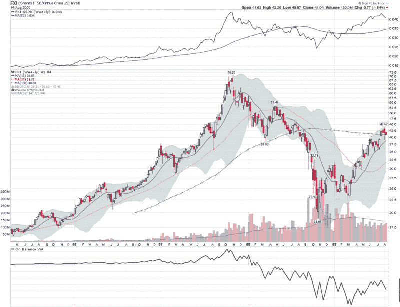

<!--yml
category: 未分类
date: 2024-05-18 17:33:37
-->

# VIX and More: Chart of the Week: China Through the Eyes of FXI

> 来源：[http://vixandmore.blogspot.com/2009/08/chart-of-week-china-through-eyes-of-fxi.html#0001-01-01](http://vixandmore.blogspot.com/2009/08/chart-of-week-china-through-eyes-of-fxi.html#0001-01-01)

One of the biggest stories of 2009 is turning out to be the rapid rebound in the [China](http://vixandmore.blogspot.com/search/label/China), both for the economy and for Chinese stocks.

Second quarter GDP was up 15% quarter-over-quarter in China and industrial production is up 10.8% year over year through July. A number of other statistics also show strong growth returning to China following the enactment of recent stimulus measures. Additionally, when pressed for areas of current and future revenue growth in their recent earnings conference calls, American companies were quick to point to the strong rebound in China as one of the few or sometimes the only area of growth.

For these reasons, I have made [FXI](http://vixandmore.blogspot.com/search/label/FXI), the [iShares FTSE/Xinhua China 25 Index](http://www.ishares.com/product_info/fund/overview/FXI.htm), the subject of this week’s [chart of the week](http://vixandmore.blogspot.com/search/label/chart%20of%20the%20week). The chart below is a weekly chart of FXI going back to April 2005 and shows the dramatic gains of 2006 and 2007, the subsequent crash from October 2007 to October 2008, and the 129% bounce from the October bottom to the August 3^(rd) top. In the two weeks since topping, FXI has fallen about 6.4%.

In the last year, Chinese stocks bottomed before their U.S. counterparts, had a much more significant bounce off of that bottom, and also topped before U.S. stocks did. Are Chinese stocks pointing to a correction? Can U.S. stocks continue to make new highs without new highs from Chinese equities? Will technical resistance at the 100 week moving average become a significant hurdle for FXI? I expect we will have much better answers to these questions before Labor Day rolls around.

For two excellent resources on Chinese markets, I recommend:

*[source: StockCharts]*