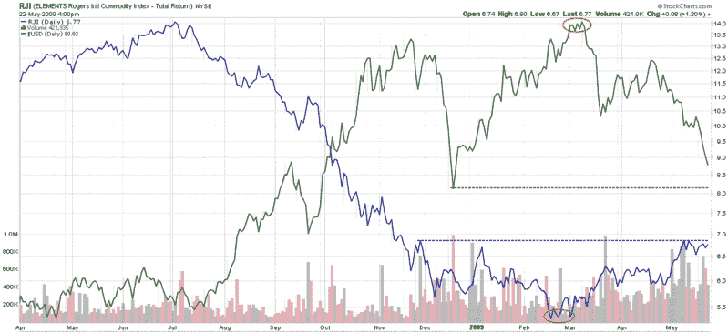

<!--yml
category: 未分类
date: 2024-05-18 17:46:08
-->

# VIX and More: Chart of the Week: Commodities and the Dollar

> 来源：[http://vixandmore.blogspot.com/2009/05/chart-of-week-commodities-and-dollar.html#0001-01-01](http://vixandmore.blogspot.com/2009/05/chart-of-week-commodities-and-dollar.html#0001-01-01)

One of the market-moving stories of the week was a decision by Standard & Poor’s to lower their outlook for AAA-rated sovereign debt of the United Kingdom from stable to negative. This action caused ripples in the [currency](http://vixandmore.blogspot.com/search/label/currencies) markets, with the [dollar](http://vixandmore.blogspot.com/search/label/dollar) coming under pressure after investors such as Bill Gross of PIMCO expressed concerns about the mounting U.S. deficit and potential future risk to the AAA credit rating for U.S. debt.

By the end of the week the dollar was at a four month low against the euro and [commodities](http://vixandmore.blogspot.com/search/label/commodities) were up sharply, partly because commodities are seen as an effective hedge against inflation.

In the [chart of the week](http://vixandmore.blogspot.com/search/label/chart%20of%20the%20week) below, I have captured a chart of the Rogers International Commodity Total Return Index ETF ([RJI](http://vixandmore.blogspot.com/search/label/RJI)) versus the U.S. dollar. The chart shows that commodities formed a bottom in mid-February and have recently attracted buying in higher volumes.

Shortly after commodities bottomed, the dollar peaked and has experienced several sharp moves down. The drop in the dollar has helped to lift prices of dollar-denominated commodities and pushed money toward commodities as a potential inflationary hedge. During the course of the past three months, commodities have had two up trending periods, each of which was followed by a consolidation period. With the dollar breaking down and in danger of testing the December support level, commodities could be preparing for another upward leg soon.

*[source: StockCharts]*