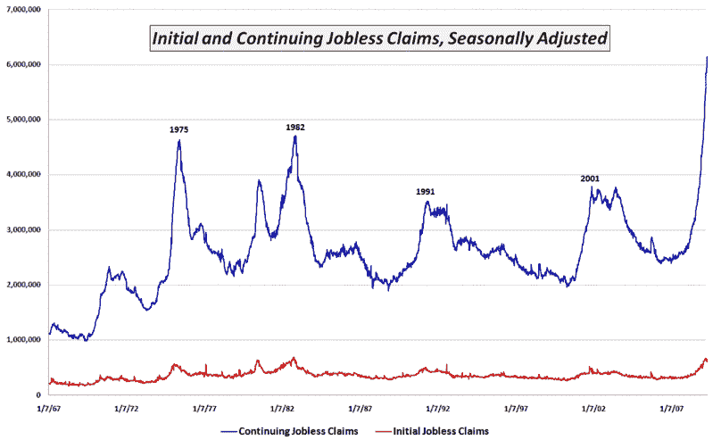

<!--yml
category: 未分类
date: 2024-05-18 17:50:27
-->

# VIX and More: Chart of the Week: Continuing Jobless Claims

> 来源：[http://vixandmore.blogspot.com/2009/04/chart-of-week-continuing-jobless-claims.html#0001-01-01](http://vixandmore.blogspot.com/2009/04/chart-of-week-continuing-jobless-claims.html#0001-01-01)

With all the hoopla over some of the green sprouts that are appearing in the economic garden and the knowledge that it has been four weeks since initial [jobless claims](http://vixandmore.blogspot.com/search/label/jobless%20claims) peaked at a level just below the October 1982 record, I wanted to provide a picture of continuing jobless claims that is very different from the more widely reported initial claims data.

The [chart of the week](http://vixandmore.blogspot.com/search/label/chart%20of%20the%20week) below tracks continuing jobless claims since 1967\. Whereas initial jobless claims (red line) are currently just below the 1982 record levels, continuing claims (blue line) have spiked to levels that dwarf 1982 levels by more than 30%.

Initial jobless claims are indeed an important concern, but right now the bigger problem is that existing jobless workers are having an extremely difficult time finding new work. Unfortunately, after setting new records for 12 weeks in a row, the trend in continuing claims shows no sign of letting up at this time.

*[source: Department of Labor]*