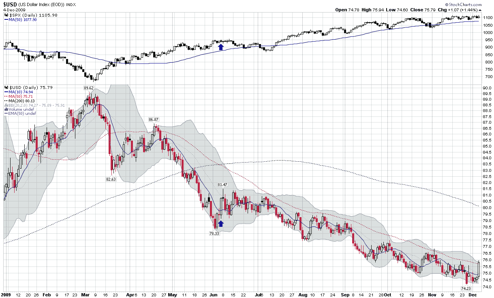

<!--yml
category: 未分类
date: 2024-05-18 17:20:59
-->

# VIX and More: Chart of the Week: Dollar Rising?

> 来源：[http://vixandmore.blogspot.com/2009/12/chart-of-week-dollar-rising.html#0001-01-01](http://vixandmore.blogspot.com/2009/12/chart-of-week-dollar-rising.html#0001-01-01)

Friday was a reminder that the [dollar](http://vixandmore.blogspot.com/search/label/dollar) will not go down every single day in an orderly, straight line fashion. In fact, there will be days when the dollar reverses sharply and sends traders who are short the currency scrambling to cover their positions, as was the case with Friday’s 1.44% gain.

In this week’s [chart of the week](http://vixandmore.blogspot.com/search/label/chart%20of%20the%20week) below, I track the fall of the dollar and simultaneous rise in the S&P 500 index that began during the first week in March. Since that time there has been only one day in which the dollar gained more than 1.44%. I have highlighted that day with blue arrows to underscore that while the prior large move in the dollar did precede a two week bounce in the currency and a four week selloff in stocks, it did not affect the underlying trend in either the dollar or stocks.

Of course it could be different this time around. For starters, the dollar closed above the 50 day moving average for the first time since mid-April. From a technical perspective, however, I would not tend to get excited about Friday’s rally until it leads to a higher high above 77 and a higher low above 75\. For now at least, the current rally should be treated as just another opportunity for some new shorts to join the dollar carry trade party.

For more on the dollar, readers are encouraged to check out:

*[source: StockCharts]*

 ****Disclosure:*** *none**