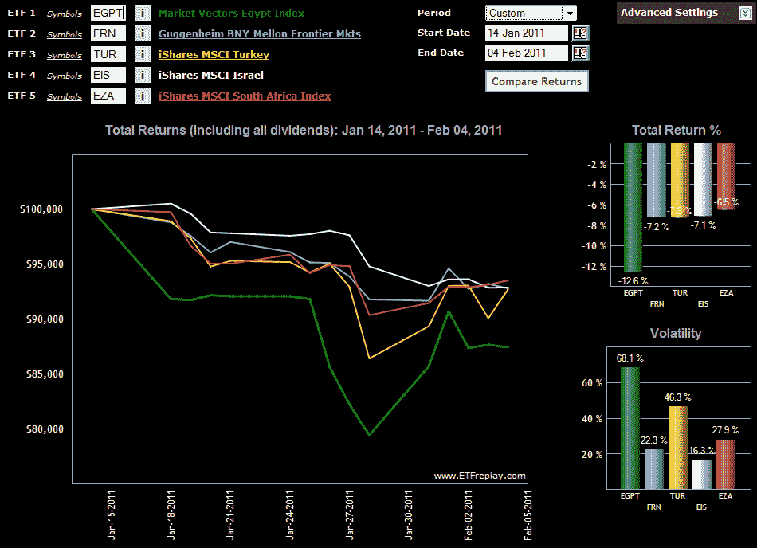

<!--yml
category: 未分类
date: 2024-05-18 16:53:27
-->

# VIX and More: Chart of the Week: EGPT and Collateral Damage

> 来源：[http://vixandmore.blogspot.com/2011/02/chart-of-week-egpt-and-collateral.html#0001-01-01](http://vixandmore.blogspot.com/2011/02/chart-of-week-egpt-and-collateral.html#0001-01-01)

Unrest in [Egypt](http://vixandmore.blogspot.com/search/label/Egypt) is barely three weeks old and already the ripple effect has crossed the globe in several waves.
I find it interesting how regional and country ETFs can be of some assistance in evaluating how investors are thinking in terms of contagion risk, be it political or economic – or at the very least in terms of the breadth and depth of the economic impact of specific events.

In this week’s [chart of the week](http://vixandmore.blogspot.com/search/label/chart%20of%20the%20week), I endeavor to track some elements of the relative geographical spread of concern with a handful of ETFs. The baseline ETF, [EGPT](http://vixandmore.blogspot.com/search/label/EGPT), shows how the situation deteriorated over the long weekend in the U.S. from January 14^(th) to January 18^(th), then began to accelerate downward during the January 26^(th) trading session.

In terms of impact, the additional four ETFs include one broad-based [frontier ETF](http://vixandmore.blogspot.com/search/label/frontier%20ETFs), [FRN](http://vixandmore.blogspot.com/search/label/FRN), and three single-country ETFs: Turkey ([TUR](http://vixandmore.blogspot.com/search/label/TUR)); Israel ([EIS](http://vixandmore.blogspot.com/search/label/EIS)); and South Africa ([EZA](http://vixandmore.blogspot.com/search/label/EZA)). Of this group, the Turkey ETF has proven to be the most volatile during the crisis and also suffered the largest drawdown. Interestingly, the Israel ETF has been the least volatile of the group, but the only one which appeared not to find a bottom on January 28^(th) and continued to trend lower. The top performer of the group is EZA, the South African ETF. EZA has fallen slightly more than half as far as EGPT since the beginning of the crisis and has steadily gained strength during the past week. Among country ETFs, EGPT and TUR were the top two performers during the past week.

Note that there are several regional ETFs which cover northern Africa and the Middle East. I discussed these during the [Dubai](http://vixandmore.blogspot.com/search/label/Dubai) crisis at some length in [Frontier ETFs](http://vixandmore.blogspot.com/search/label/frontier%20ETFs) and [Chart of the Week: Market Vectors Gulf States ETF (MES)](http://vixandmore.blogspot.com/2009/11/chart-of-week-market-vectors-gulf.html).

Related posts:

*[source: ETFreplay.com]*

****Disclosure(s):*** *long TUR at time of writing**