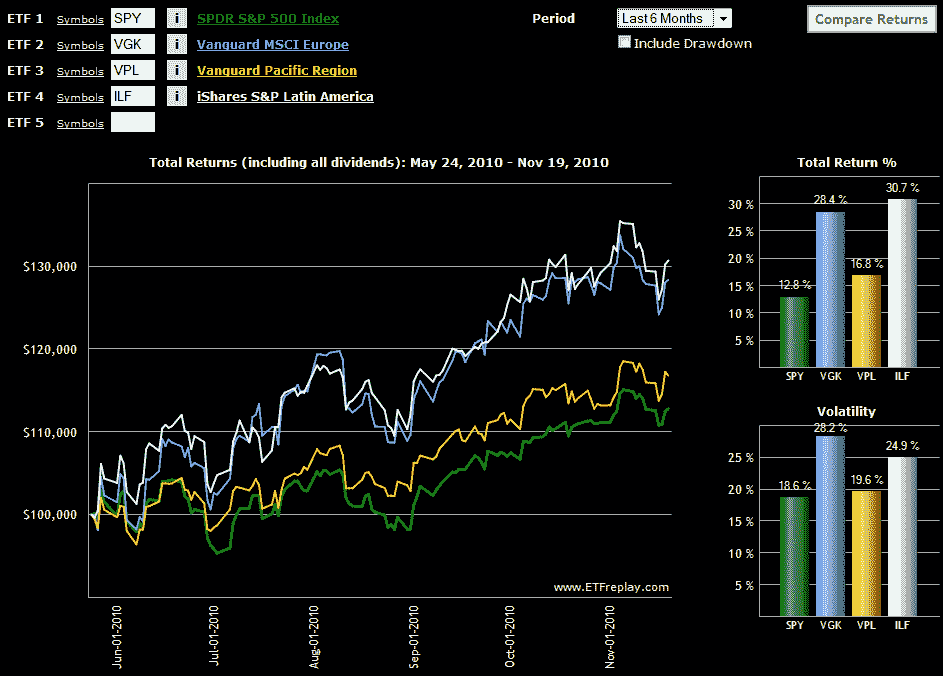

<!--yml
category: 未分类
date: 2024-05-18 16:58:22
-->

# VIX and More: Chart of the Week: European Stocks Holding Up Well

> 来源：[http://vixandmore.blogspot.com/2010/11/chart-of-week-european-stocks-holding.html#0001-01-01](http://vixandmore.blogspot.com/2010/11/chart-of-week-european-stocks-holding.html#0001-01-01)

Six months ago the [European sovereign debt crisis](http://vixandmore.blogspot.com/search/label/European%20sovereign%20debt%20crisis) was flaring up and my [chart of the week](http://vixandmore.blogspot.com/search/label/chart%20of%20the%20week) was the [Flight-to-Safety Trade](http://vixandmore.blogspot.com/2010/05/chart-of-week-flight-to-safety-trade.html).

With the joint EU-IMF bailout of [Ireland](http://vixandmore.blogspot.com/search/label/Ireland) unfolding over the weekend and the future of [Greece](http://vixandmore.blogspot.com/search/label/Greece) and [Portugal](http://vixandmore.blogspot.com/search/label/Portugal) in the euro zone also being called into question over the course of the past two weeks, this seems like a good time to compare the performance of Europe against some of the other continents.

While relative performance is almost always dependent upon the date one picks as a starting point, I still think many will be surprised to see in this week’s chart of the week below that at least over the course of the past six month,s Europe ([VGK](http://vixandmore.blogspot.com/search/label/VGK)) has performed on par with Latin America ([ILF](http://vixandmore.blogspot.com/search/label/ILF)) and has significantly outperformed Asia ([VPL](http://vixandmore.blogspot.com/search/label/VPL)) and the United States. Should Europe be able to finish the year without giving up any ground to its counterpart regional ETFs, I think the continent should be allowed to exhale and declare victory, at least for 2010.

For more on related subjects, readers are encouraged to check out:

***Disclosure(s):*** *none*

*[source: ETFreplay.com]*