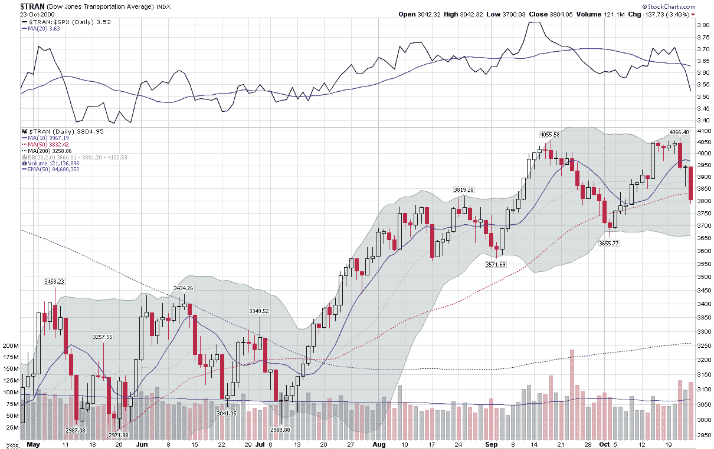

<!--yml
category: 未分类
date: 2024-05-18 17:25:18
-->

# VIX and More: Chart of the Week: Falling Transports

> 来源：[http://vixandmore.blogspot.com/2009/10/chart-of-week-falling-transports.html#0001-01-01](http://vixandmore.blogspot.com/2009/10/chart-of-week-falling-transports.html#0001-01-01)

For the most part, last week saw some mild negative numbers in most of the major market indices. One particular index that is closely watched by many, however, was particularly hard hit. The [Dow Jones Transportation Average](http://en.wikipedia.org/wiki/Dow_Jones_Transportation_Average) ([DJTA](http://vixandmore.blogspot.com/search/label/DJTA)), an essential component of [Dow Theory](http://en.wikipedia.org/wiki/Dow_Theory), fell 5.4% for the week and was particularly hard hit on Friday.

Before the market opened on Friday, two of the three railroads in the DJTA reported earnings and while the bottom line numbers were impressive, investors were spooked by substantial revenue declines. Burlington Northern Santa Fe ([BNI](http://vixandmore.blogspot.com/search/label/BNI)) reported a quarterly revenue decline of 27% from the comparable quarter in 2008, while Union Pacific ([UNP](http://vixandmore.blogspot.com/search/label/UNP)) reported a 24% drop in revenues for the same period. The weak revenue picture helped to push the DJTA to a loss of 3.5% on Friday and create what looks for now to be a provisional double top in the index in the [chart of the week](http://vixandmore.blogspot.com/search/label/chart%20of%20the%20week) below.

While I am by no means a strict adherent to Dow Theory, I do think the transports are important to watch, particularly when they signal a different economic client than is being reported by the manufacturing sector. The transports will be an important sector to watch going forward.

*[source: StockCharts]*