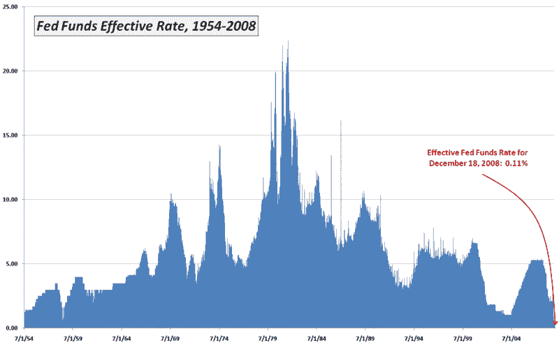

<!--yml
category: 未分类
date: 2024-05-18 18:09:51
-->

# VIX and More: Chart of the Week: Fed Funds Rate Drops to 0.11%

> 来源：[http://vixandmore.blogspot.com/2008/12/chart-of-week-fed-funds-rate-drops-to.html#0001-01-01](http://vixandmore.blogspot.com/2008/12/chart-of-week-fed-funds-rate-drops-to.html#0001-01-01)

Thanks to the Federal Reserve’s decision to drop their target Fed Funds rate to an all-time record of 0.00% to 0.25%, the subject of this week’s [chart of the week](http://vixandmore.blogspot.com/search/label/chart%20of%20the%20week) is a no brainer.

The Fed has 55 years of Fed Funds rate data and I have chosen to highlight not the target rate announced by the FOMC, but the daily effective federal funds rate, which is a volume-weighted average of rates on trades arranged by major brokers.

Not surprisingly, Friday’s effective Fed Funds rate of 0.11% is a record low, but that record was actually established on December 10^(th) and tied again on Friday.

For history buffs, the record high of 22.36% dates back to July 22, 1981\. The average Fed Funds rate since 1954 is 5.62%.

*[source: Federal Reserve Bank, VIX and More]*