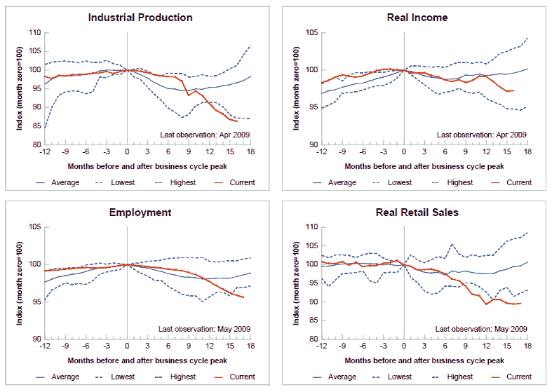

<!--yml
category: 未分类
date: 2024-05-18 17:42:52
-->

# VIX and More: Chart of the Week: Four Key Economic Indicators

> 来源：[http://vixandmore.blogspot.com/2009/06/chart-of-week-four-key-economic.html#0001-01-01](http://vixandmore.blogspot.com/2009/06/chart-of-week-four-key-economic.html#0001-01-01)

For the second week in a row, the [chart of the week](http://vixandmore.blogspot.com/search/label/chart%20of%20the%20week) focuses on economic fundamentals. This week I am featuring a graphic from the [Federal Reserve Bank of St. Louis](http://stlouisfed.org/), that attempts to summarize current recession in terms of [industrial production](http://vixandmore.blogspot.com/search/label/industrial%20production), real income, employment and [retail sales](http://vixandmore.blogspot.com/search/label/retail%20sales).

Starting from a business cycle peak of December 2007, the graphic below is an effort to normalize and rescale the economic data by assigning an index value of 100 to December 2007 numbers for each of the four statistics, so that comparative changes are easier to evaluate. Note that for each series, the average, high and low values are plotted for each month following the prior business cycle high. For industrial production, employment, and real retail sales, the average series includes the 10 recessions starting with the November 1948 business cycle peak. For real income, the average starts with the April 1960 peak.

In terms of conclusions, the current recession is establishing new lows for industrial production, employment and retail sales. Curiously, real income, while low, is not even approaching record lows.

Note also that in prior recessions, employment and retail sales have usually started to rebound by now, with real income and industrial production taking longer to bottom.

Going forward, it will be interesting to see how long some of these indicators continue to set record lows and how long before they rebound to the levels of the “average recession’”

[As an aside, for those looking for a top notch repository of raw Federal Reserve economic data and some native charting capabilities, the St. Louis Fed’s [Federal Reserve Economic Data (FRED)](http://research.stlouisfed.org/fred2/) site should probably be your first stop.]

*[source: Federal Reserve Bank of St. Louis]*