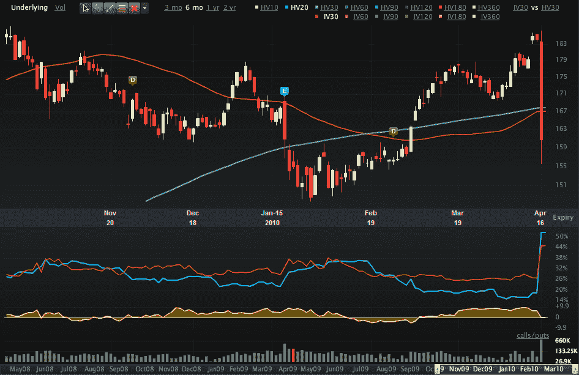

<!--yml
category: 未分类
date: 2024-05-18 17:11:38
-->

# VIX and More: Chart of the Week: Goldman Sachs

> 来源：[http://vixandmore.blogspot.com/2010/04/chart-of-week-goldman-sachs.html#0001-01-01](http://vixandmore.blogspot.com/2010/04/chart-of-week-goldman-sachs.html#0001-01-01)

There is no reason to get fancy with this week’s [chart of the week](http://vixandmore.blogspot.com/search/label/chart%20of%20the%20week). The big story of the week was accusations of fraud at Goldman Sachs ([GS](http://vixandmore.blogspot.com/search/label/GS)), with the SEC claiming Goldman misrepresented the selection process for some collateralized debt obligations (CDOs) resulting in a fraud worth $1 billion.

The chart below captures six months of price action in GS and shows how Friday’s selloff erased most of the gains in the stock from the last three months. Of particular interest is the spike in both [historical volatility](http://vixandmore.blogspot.com/search/label/historical%20volatility) (HV20) and [implied volatility](http://vixandmore.blogspot.com/search/label/implied%20volatility) (IV30), with historical volatility now higher than its forward-looking implied volatility counterpart. With elevated volatility, options traders are loving GS for now, whether they have thoughts about the future direction of GS stock or are just looking to sell options to capture the extra premium.

Note that Goldman is scheduled to report earnings before the market opens on Tuesday.

For more on related subjects, readers are encouraged to check out:

*[source: Livevol Pro]* 

***Disclosure(s):*** *Livevol is an advertiser on VIX and More*