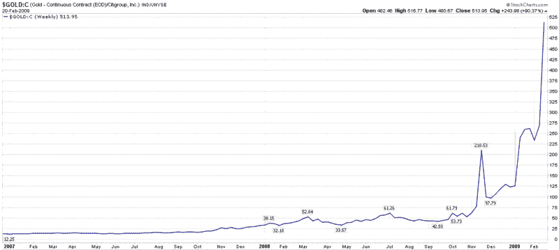

<!--yml
category: 未分类
date: 2024-05-18 17:58:34
-->

# VIX and More: Chart of the Week: How Much Citigroup for My Gold?

> 来源：[http://vixandmore.blogspot.com/2009/02/chart-of-week-how-much-citigroup-for-my.html#0001-01-01](http://vixandmore.blogspot.com/2009/02/chart-of-week-how-much-citigroup-for-my.html#0001-01-01)

In 2001, an investor who wanted to exchange his [gold](http://vixandmore.blogspot.com/search/label/gold) bullion for Citigroup ([C](http://vixandmore.blogspot.com/search/label/C)) shares was able to acquire about six shares of stock for each ounce of gold. With Citigroup closing just under 2.00 yesterday and gold above the 1000.00 mark, that same swap now entitles the holder of gold to about 514 Citigroup shares.

The change in fortunes says much less about gold, which is almost 300% above the 2001 lows, than it does about Citigroup, which has fallen about 96% from an early 2007 high.

This week’s [chart of the week](http://vixandmore.blogspot.com/search/label/chart%20of%20the%20week) chronicles the ratio of gold continuous contract futures to the price of Citigroup stock, essentially tracking the exchange rate for Citigroup in gold since the beginning of 2007\. In many respects, this chart is also an excellent proxy for the magnitude of the problems facing the U.S. banking system.

[As an aside, now three months old, the full history of the *VIX and More* Chart of the Week series can be found by following the [chart of the week](http://vixandmore.blogspot.com/search/label/chart%20of%20the%20week) link.]

*[source: StockCharts]*