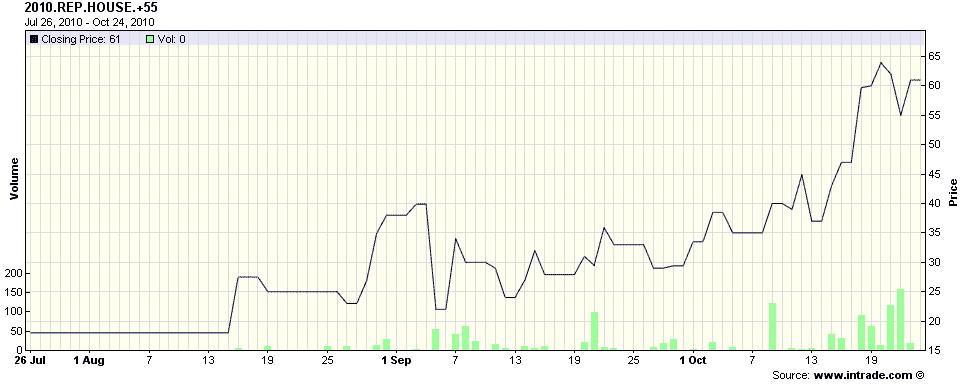

<!--yml
category: 未分类
date: 2024-05-18 17:00:22
-->

# VIX and More: Chart of the Week: Intrade and the Midterm Elections

> 来源：[http://vixandmore.blogspot.com/2010/10/chart-of-week-intrade-and-midterm.html#0001-01-01](http://vixandmore.blogspot.com/2010/10/chart-of-week-intrade-and-midterm.html#0001-01-01)

Three months ago in [Chart of the Week: Intrade and Control of the House of Representatives](http://vixandmore.blogspot.com/2010/07/chart-of-week-intrade-and-control-of.html), I used an [Intrade.com](http://www.intrade.com/) contract as the [chart of the week](http://vixandmore.blogspot.com/search/label/chart%20of%20the%20week) to illustrate how the markets were assigning probabilities to whether the Republicans would control the House of Representatives following the upcoming November 2^(nd) election. At the time, that contract had last traded for 55.1, which roughly translates to a 55.1% probability of Republican control.

Just two weeks and two days before voters go to the polls, that same contract is trading at 90, meaning that the markets are about 90% sure that Republicans will control the House following the election. Among the more critical questions at this juncture are how many seats the Democrats will retain in the Senate and just how many seats the Republicans will gain in the House. The contracts covering the House gains are issued in increments of five seat strikes, so that there are separate contracts for a gain of 50 or more seats, 55 or more, 60 or more, etc. Right now the most active trading can be found in the at-the-money contracts, with the +55 seat contract last quoted at 57.9 bid and 61.8 ask, while the +60 seat contract last quoted at 38.1 bid and 43.8 ask.

The chart below, courtesy of [Intrade](http://vixandmore.blogspot.com/search/label/Intrade), tracks the trading in the +55 seat contract for the past 90 days. Note that this contract crossed the 50 threshold one week ago today and last traded at 61\. Looking at the various contracts, prior to the contracts, the highest seat count that was trading over 50 was +45 seats. During the second week in October, both the +50 and the +55 seat contracts rose above the 50 level. With the recent heavy betting on the +60 seat contract and its doubling in price over the course of the last month, it looks as if this is the contract to watch to see how the far the balance of power appears to be tipping in the direction of the Republicans.

As I noted the last time around, for those who are interested in a seat-by-seat, poll-by-poll perspective on the election, [RealClearPolitics.com](http://realclearpolitics.com/) is a great place to start. Those like me who are more interested in assigning probabilities to the overall outcome may prefer to keep an eye on [Intrade.com](http://www.intrade.com/), the popular [prediction market](http://vixandmore.blogspot.com/search/label/prediction%20markets) site.

Finally, it is probably stating the obvious, but don’t be surprised to discover that there is a relationship between the projected Republican seat gains and the stock market.
Related posts:

*[source: Intrade.com]*

****Disclosure(s):*** *none**