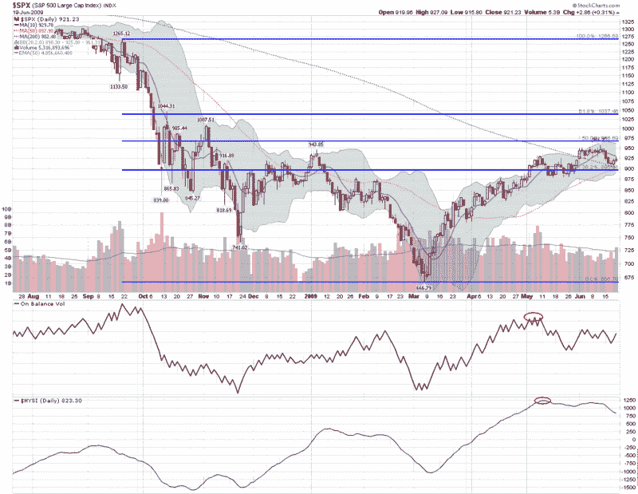

<!--yml
category: 未分类
date: 2024-05-18 17:41:49
-->

# VIX and More: Chart of the Week: Lack of Volume and Breadth Threatens Bull Move

> 来源：[http://vixandmore.blogspot.com/2009/06/chart-of-week-lack-of-volume-and.html#0001-01-01](http://vixandmore.blogspot.com/2009/06/chart-of-week-lack-of-volume-and.html#0001-01-01)

In the last few weeks, stocks have struggled to add to recent gains, suffering even more from a lack of buying interest than from selling pressure.

The [chart of the week](http://vixandmore.blogspot.com/search/label/chart%20of%20the%20week) below is an attempt to use two basic indicators to capture the lack of volume and market breadth that has undermined the March to mid-June rally. As a measure of market volume, I have chosen to highlight [on balance volume](http://vixandmore.blogspot.com/search/label/on%20balance%20volume) (OBV), which is a running total of the volume on up days minus the volume on down days. This indicator is excellent at highlighting trends which are at risk due to declining volume, which is exactly what the warning suggested when there was a peak in OBV during the first two weeks of May.

In a similar vein, the [McClellan Summation Index](http://vixandmore.blogspot.com/search/label/McClellan%20Summation%20Index) (aka the NYSE Summation Index or NYSI) shows market breadth as derived from the net daily advancing stocks minus declining stocks. The McClellan Summation Index did turn up at the end of February, just before the March bottom and is generally an excellent tool for gauging trends in market breadth.

In addition to the May highs, note that both OBV and the McClellan Summation Index have recently made lower highs as well. While OBV shows some indications of steadying at current levels, the larger concern is the decline in market breadth issues highlighted by the McClellan Summation Index.

Like all indicators, these two are far from perfect, but they often provide important information about the decline in strength and potential for reversal in major trends.

For additional information on the subjects above try:

*[graphic: StockCharts]*