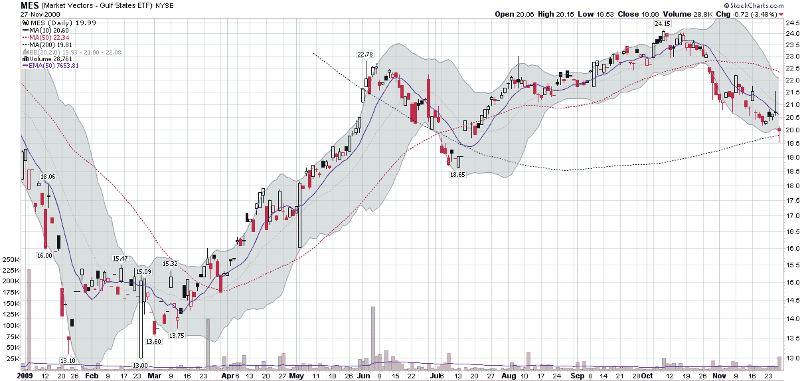

<!--yml
category: 未分类
date: 2024-05-18 17:21:49
-->

# VIX and More: Chart of the Week: Market Vectors Gulf States ETF (MES)

> 来源：[http://vixandmore.blogspot.com/2009/11/chart-of-week-market-vectors-gulf.html#0001-01-01](http://vixandmore.blogspot.com/2009/11/chart-of-week-market-vectors-gulf.html#0001-01-01)

With all the hoopla over the [Dubai](http://vixandmore.blogspot.com/search/label/Dubai) debt situation, I am surprised that there has been so little talk about Middle Eastern ETFs in general and ETFs with exposure to the United Arab Emirates (UAE) in particular. Part of the reason for the lack of mention is surely that there is little to choose from; the other problem is a lack of liquidity and investor interest to date. Only two ETFs with strong Middle Eastern exposure warrant mentioning: the Market Vectors Gulf States ETF ([MES](http://vixandmore.blogspot.com/search/label/MES)); and the Wisdom Tree Middle East Dividend ETF ([GULF](http://vixandmore.blogspot.com/search/label/GULF).) Neither of these ETFs is particularly liquid (neither traded over 30,000 shares on Friday) and both have managed to avoid detection by all but the most adventuresome ETF investors.

A third ETF that sometimes gets throw into the mix is the SPDR S&P Emerging Middle East and Africa ETF ([GAF](http://vixandmore.blogspot.com/search/label/GAF).) While GAF trades an average of more than 50,000 shares per day, it is important to understand that this is largely a South African investment at the moment. As of September 30, this ETF had 62% of its assets invested in South Africa, 24% in Israel, 7% in Morocco and 6% in Egypt. Notably absent are positions in the likes of the United Arab Emirates, Kuwait and Qatar.

Between MES and GULF, I have a slight preference for MES as an opportunity to gain exposure to the United Arab Emirates, which is why I have included MES as this week's [chart of the week](http://vixandmore.blogspot.com/search/label/chart%20of%20the%20week) below. At the end of September, MES ([holdings](http://www.marketvectorsetfs.com/index.cfm?cat=4111&cGroup=ETF&ln=3-05&tab=2)) had a 25.5% exposure to the UAE, the second highest country concentration behind a 47.7% investment in Kuwait. By contrast, GULF ([holdings](http://www.wisdomtree.com/etfs/fund-details.asp?etfid=69)) had a 17.5% exposure to the UAE at the same time, which ranked second to Qatar at 30.5%.

In my opinion, there is not sufficient liquidity in either ETF to warrant any sort of trading strategy or large positions at this time, but I would not be surprised to see one or both begin to generate some more impressive volume numbers in the coming week and perhaps open up some new opportunities.

*[source: StockCharts.com]*