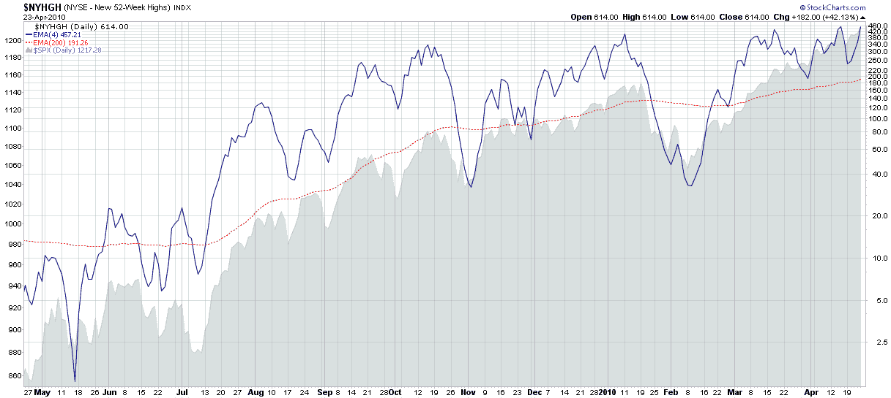

<!--yml
category: 未分类
date: 2024-05-18 17:11:23
-->

# VIX and More: Chart of the Week: New 52-Week Highs

> 来源：[http://vixandmore.blogspot.com/2010/04/chart-of-week-new-52-week-highs.html#0001-01-01](http://vixandmore.blogspot.com/2010/04/chart-of-week-new-52-week-highs.html#0001-01-01)

There has been a good deal of debate in the investment community lately about whether equities are currently overbought. As a look at charts of individual equities I am struck by the number of stocks that are now making fresh [52-week highs](http://vixandmore.blogspot.com/search/label/52%20week%20highs).

This week’s [chart of the week](http://vixandmore.blogspot.com/search/label/chart%20of%20the%20week) below chronicles one year of [52-week highs in the NYSE](http://vixandmore.blogspot.com/search/label/NYSE%20new%20highs). Using new highs as an indicator of internal market strength, it is easy to see how momentum has continued to build over the course of the last year, with so many stocks hitting new highs last Friday (614 on the NYSE) that breakouts to new highs have created their own self-sustaining demand.

It only takes a couple of negative days to turn the new high trend in the other direction, but I have always been reluctant to short stocks that are making new highs. Even at historically elevated levels, an increasing number of new highs is a sign of strong market [breadth](http://vixandmore.blogspot.com/search/label/breadth) and a healthy, broadly diversified rally.

For more on related subjects, readers are encouraged to check out:

*[source: StockCharts.com]*Edit:

Steve Place had an excellent suggestion that I try an arithmetically scaled (proportionally spaced) chart for these data sets. I have added a second chart with that arithmetically scaled Y-axis

[here](http://i104.photobucket.com/albums/m163/bl82/NYHGHarith042310.png)

.

***Disclosure(s):*** *none*