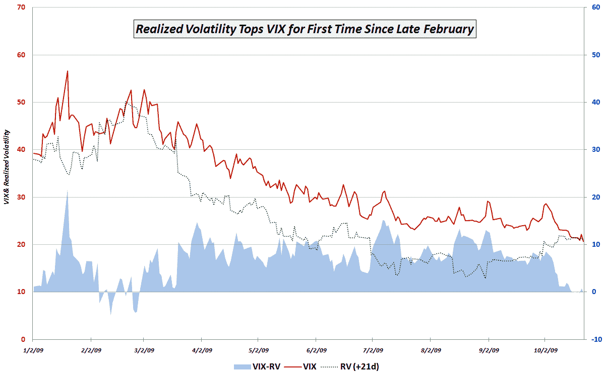

<!--yml
category: 未分类
date: 2024-05-18 17:22:22
-->

# VIX and More: Chart of the Week: No More Free Lunch for Volatility Sellers?

> 来源：[http://vixandmore.blogspot.com/2009/11/chart-of-week-no-more-free-lunch-for.html#0001-01-01](http://vixandmore.blogspot.com/2009/11/chart-of-week-no-more-free-lunch-for.html#0001-01-01)

One month ago the VIX closed at a 2009 record low of 20.69, so it should not be a big surprise that [realized volatility](http://vixandmore.blogspot.com/search/label/realized%20volatility) over the course of the past month has been higher than predicted by the VIX. What I find interesting about this development is that last week was the first time since February 27^(th) (exactly one week before the market bottomed) that 21 day realized volatility turned out to be higher than the level of volatility predicted by the VIX.

What does this mean?

In the [chart of the week](http://vixandmore.blogspot.com/search/label/chart%20of%20the%20week) below, I show the relationship between the VIX and realized volatility 21 days hence since the beginning of the year. The key point to emphasize is that since the beginning of 2009 (actually going back to 11/20/2008) the VIX had anticipated higher volatility that actually occurred in the next 21 trading days in all but 9 trading days in February – until last week. On Monday, Wednesday and Friday of last week, the nine month string was broken, as 21day realized volatility exceed that of the VIX from 30 days ago.

While one may argue about the ability of the VIX and realized volatility to predict market direction (in my opinion, it is a reasonably successful indicator, but a long way from perfect), there is no arguing that those who have been selling volatility and pocketing easy money since the March bottom in stocks are now finding that the ‘volatility gap’ which had been providing such reliable profits is no longer intact.

Going forward, I think the gap between the VIX and realized volatility should be watched for market direction clues, but more importantly, it should provide clues about whether opportunities to sell volatility for an easy profit are still available – and thus provide a window into the mind of options traders.

For additional posts on related subjects, readers are encouraged to check out:

