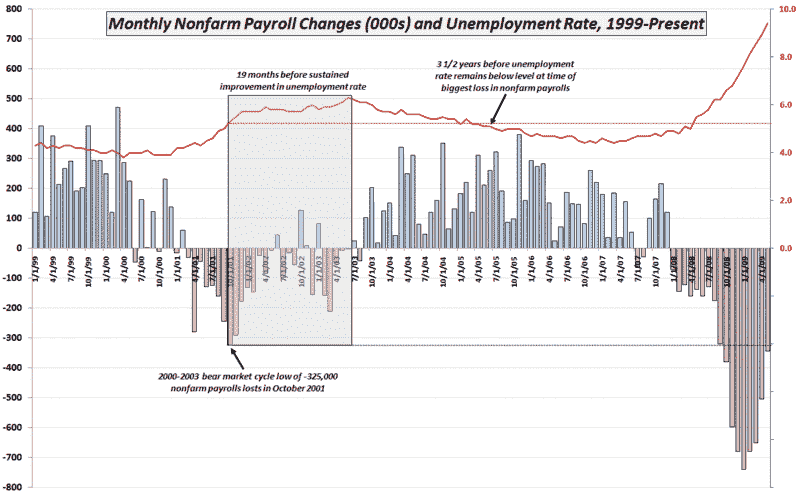

<!--yml
category: 未分类
date: 2024-05-18 17:44:14
-->

# VIX and More: Chart of the Week: Nonfarm Payrolls, Unemployment Rates and Time

> 来源：[http://vixandmore.blogspot.com/2009/06/chart-of-week-nonfarm-payrolls.html#0001-01-01](http://vixandmore.blogspot.com/2009/06/chart-of-week-nonfarm-payrolls.html#0001-01-01)

As much as I enjoy technical analysis and sentiment charts, it is time the [chart of the week](http://vixandmore.blogspot.com/search/label/chart%20of%20the%20week) addressed one of the many fundamental macroeconomic issues currently being debated.

This week’s chart combines two important jobs numbers from [Friday’s employment report](http://www.bls.gov/news.release/empsit.nr0.htm): monthly changes in [nonfarm payroll employment](http://vixandmore.blogspot.com/search/label/nonfarm%20payrolls) and the [unemployment rate](http://vixandmore.blogspot.com/search/label/unemployment%20rate). In some respects, this week’s data seemed to be conflicting, as the nonfarm payrolls were not as bad as expected, yet the unemployment rate was worse than anticipated. Part of the reason for this is that data is derived from two different sources. The nonfarm payrolls are the result of a survey of businesses, while the unemployment rate number is calculated on the basis of a survey of households.

*[Without straying too far from the subject at hand, I want to highlight an often overlooked component of the nonfarm payroll that is known as the so-called [birth/death model](http://vixandmore.blogspot.com/search/label/birth%2Fdeath%20model). This statistical construct added 220,000 jobs to the survey results, with the majority of these ‘birth/death’ additions coming from the construction, hospitality and leisure segments. I have some skepticism about the birth/death model adjustments to the May data, but will leave that subject for another post. In the meantime, those who are interested in learning more about what I am referencing may wish to review:*

The chart below dates back to 1999 and captures the full history of the 2000-2003 economic slowdown and bear market. Note that the peak monthly decline in nonfarm payrolls (dotted black line) was a loss of 325,000 jobs in October 2001\. The shaded gray area highlights the subsequent 19 months in which job losses decreased, yet the unemployment rate jumped from 5.3% to 6.3% during this period in what was known as a jobless recovery. As the chart shows, it was a full 3 ½ years before the unemployment rate was able to drop below and remain below the 5.3% level (dotted red line) of October 2001\. Worse yet, even the substantial improvement in the May 2009 data puts job losses at a level higher than the 2002-2003 peak. Simply stated, the job situation is not improving, but the rate of deterioration has slowed.

I have no reason to believe that the recovery from current recession will be any faster than the recovery from the last recession. If anything, the arguments for a longer deeper recession seem compelling. Even if we have the same type of jobs recovery that we had the last time around, however, investors may want to think in terms of 3-4 years or perhaps more before unemployment recedes to the 7.6% level from the peak January job losses of 741,000.

*[source: Bureau of Labor Statistics]*