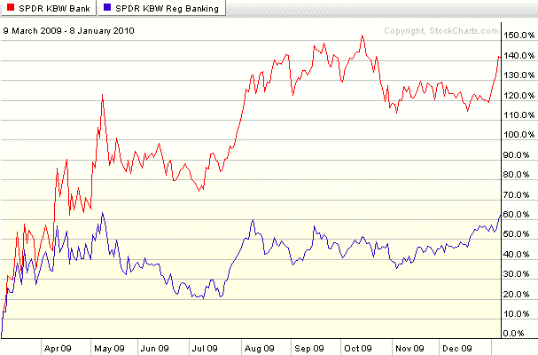

<!--yml
category: 未分类
date: 2024-05-18 17:17:55
-->

# VIX and More: Chart of the Week: Regional Banks Rising?

> 来源：[http://vixandmore.blogspot.com/2010/01/chart-of-week-regional-banks-rising.html#0001-01-01](http://vixandmore.blogspot.com/2010/01/chart-of-week-regional-banks-rising.html#0001-01-01)

In 2010 I have a bunch of indicators I will be looking at in order to get a sense of how the economy and the stock market are performing. One of the ones I am choosing to profile in this week’s [chart of the week](http://vixandmore.blogspot.com/search/label/chart%20of%20the%20week) is the relative performance of regional banks ([KRE](http://vixandmore.blogspot.com/search/label/KRE)) to the broader banking sector ([KBE](http://vixandmore.blogspot.com/search/label/KBE)).

The rationale is fairly simple. While the money center banks have benefited disproportionately from various crisis-related government programs and policies over the course of the past year or so, for the most part regional banks have been left to their own devices. The investment hypothesis is that ultimately the fate of regional banks will be a better barometer of the breadth of the economic recovery, the health of the commercial real estate market and the ability of small businesses and local economies to regenerate and grow.

The chart below shows that from the March lows through early October, regional banks were lagging the banking sector significantly, but in the last two months or so, regional banks have rallied impressively relative to a sluggish banking sector and are currently much closer to their 52 week highs than the broader banking index. Regional banks still face considerable obstacles, but their performance relative to money center banks and the broader banking sector should continue to provide an accurate picture of the health of local economies across the country – and one that is less likely to be distorted by policies and legislation coming out of Washington.

For more on related subjects, readers are encouraged to check out:

*[source: StockCharts]*

***Disclosure****: Long KBE at time of writing*