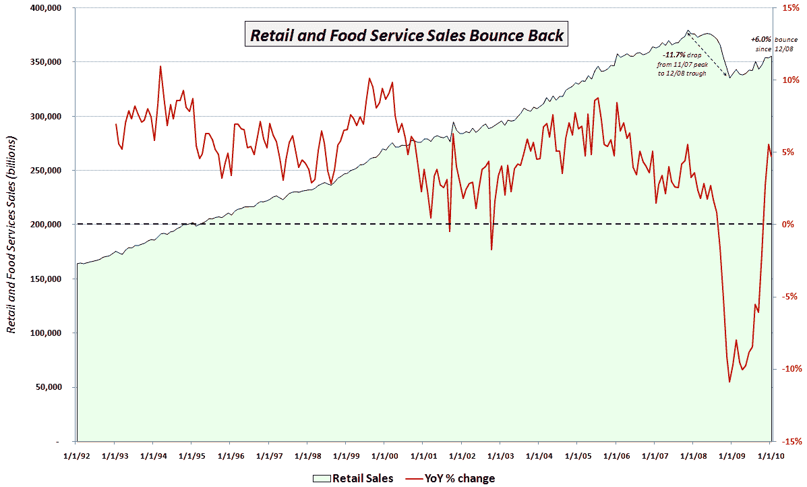

<!--yml
category: 未分类
date: 2024-05-18 17:15:25
-->

# VIX and More: Chart of the Week: Retail Sales Recovering

> 来源：[http://vixandmore.blogspot.com/2010/02/chart-of-week-retail-sales-recovering.html#0001-01-01](http://vixandmore.blogspot.com/2010/02/chart-of-week-retail-sales-recovering.html#0001-01-01)

With all eyes seemingly focused on Europe last week, it seems as if investors largely ignored the new economic data coming out of the United States.

I consider the most important of the new pieces of economic data to be the January [retail sales](http://vixandmore.blogspot.com/search/label/retail%20sales) report, which showed retail sales increasing 0.5% on a month-over-month basis (consensus estimate +0.3%) and 4.7% on a year-over-year basis.

The [chart of the week](http://vixandmore.blogspot.com/search/label/chart%20of%20the%20week) below attempts to put the recent retail sales numbers into a meaningful historical context. Since the media generally only reports the month-over-month change from the [Census Bureau](http://www.census.gov/cgi-bin/briefroom/BriefRm) press release, I thought I would add a couple of my own twists. First, the green area data series below captures the aggregate retail and food service sales in green going back to 1992\. Note that until the beginning of 2009, there was never a sustained dip in retail sales. The red line overlays the year-over-year percentage change in retail sales. Given the relatively shallow historical dips, this number was never only negative twice prior to 2008: once in 2001; and a second time in 2002.

Starting in September 2008, the year-over-year change in retail sales was negative for 14 consecutive months. That streak was finally broken in November 2009, but when retail sales slipped during December, there were rumblings about the sustainability of the bounce in retail sales. January’s positive surprise has at least temporarily shelved some of those concerns and brought new buyers into the retail sector, where the two 800 lb. gorilla ETFs ([XRT](http://vixandmore.blogspot.com/search/label/XRT) and [XLY](http://vixandmore.blogspot.com/search/label/XLY)) have seen renewed interest.

The chart also annotates the 11.7% drop in retail sales from the October 2007 peak to the December 2008 cycle low. Since the low, retail sales have bounced 6.0% or 2.7% in real terms. It will likely be another year or two before retail sales return to their October 2007 highs, but to this point, the consumer has been much more resilient than many pundits had expected.

For more on related subjects, readers are encouraged to check out:  

*[source: Federal Reserve Bank of St. Louis]*  ***Disclosures:*** *none*