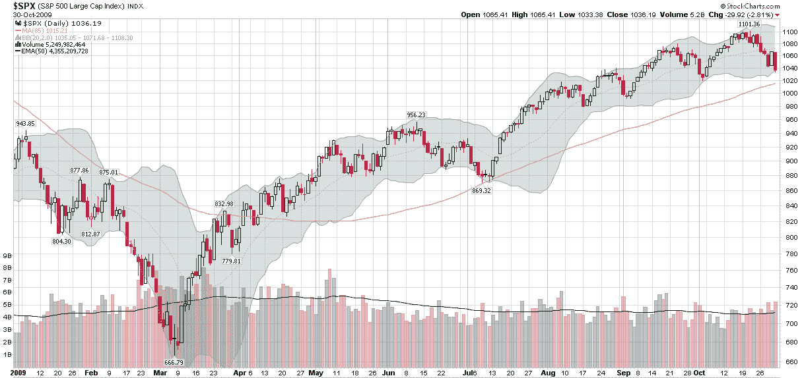

<!--yml
category: 未分类
date: 2024-05-18 17:23:55
-->

# VIX and More: Chart of the Week: Reverse Engineering a Critical Moving Average

> 来源：[http://vixandmore.blogspot.com/2009/11/chart-of-week-reverse-engineering.html#0001-01-01](http://vixandmore.blogspot.com/2009/11/chart-of-week-reverse-engineering.html#0001-01-01)

This week’s [chart of the week](http://vixandmore.blogspot.com/search/label/chart%20of%20the%20week) is a simple reminder that while many of us like to standardize on 20, 50 and 200 day moving averages, these rarely always align perfectly with historical data. In fact, it often makes sense to develop customized moving averages that circumscribe past price action in order to get a better understanding of how current forces acting on stock prices compare to past forces.

One such example is in the chart below. The ‘usual suspects’ of moving averages fail to identify support levels from the July SPX low of 869\. When this happens, then a little trial and error can quickly produce exactly which moving average provided support to the underlying. In this case an 85 day moving average did the trick. While I am not saying that an 85 day moving average is the answer to all charting problems, it is reasonable to expect that if the current market downturn penetrates the 85 day moving average, it will be a move that is comparable to or more powerful than the July pullback.

Sometimes data optimization can be a dangerous game, but when it comes to moving averages and charts, optimizing can serve a useful purpose.

*[source: StockCharts]*