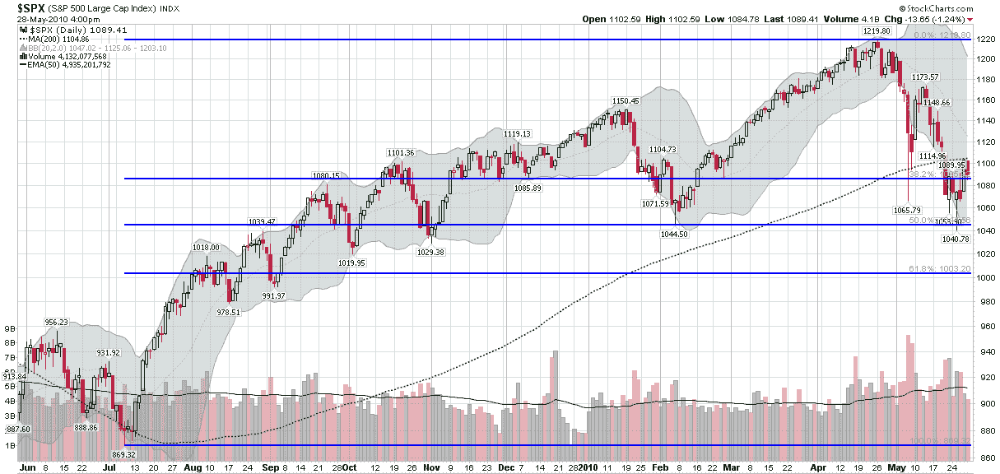

<!--yml
category: 未分类
date: 2024-05-18 17:09:21
-->

# VIX and More: Chart of the Week: SPX, Fibs and 200 Day MA

> 来源：[http://vixandmore.blogspot.com/2010/06/chart-of-week-spx-fibs-and-200-day-ma.html#0001-01-01](http://vixandmore.blogspot.com/2010/06/chart-of-week-spx-fibs-and-200-day-ma.html#0001-01-01)

This week’s [chart of the week](http://vixandmore.blogspot.com/search/label/chart%20of%20the%20week) is an attempt to offer something relatively simple and uncluttered: a one year look at the S&P 500 index.

The chart below shows daily bars of the SPX, with four highlighted overlays:

1.  A 200 day moving average (dotted green line) – currently at 1105, moving up about two points a week and looming as possible upside resistance

2.  [Fibonacci](http://vixandmore.blogspot.com/search/label/Fibonacci) retracement levels drawn from the July 2009 low of 869 to the April 2010 high of 1219 – these generate a 50% retracement level of 1044 (recent support) and a 38.2% retracement level of 1085 (just below current levels)

3.  Volume, including a 50 day moving average (solid green line) – which shows activity picking up dramatically in May

4.  Bollinger bands (the gray cloud, based on 20 days and 2 standard deviations)

Apart from noting that the 200 day MA and Fibonacci retracement levels (particularly 1085 at the moment) look to be important lines in the sand, I will leave the balance of the conclusions to the reader.

*[source: StockCharts.com]* 

***Disclosure(s):*** *none*