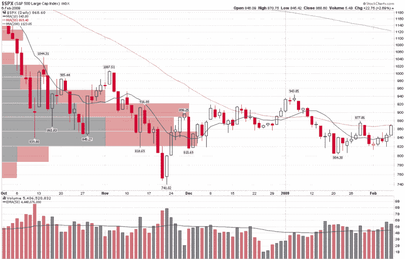

<!--yml
category: 未分类
date: 2024-05-18 18:01:16
-->

# VIX and More: Chart of the Week: SPX Price by Volume

> 来源：[http://vixandmore.blogspot.com/2009/02/chart-of-week-spx-price-by-volume.html#0001-01-01](http://vixandmore.blogspot.com/2009/02/chart-of-week-spx-price-by-volume.html#0001-01-01)

There are many methods that technicians use to help determine when various market moves may run into significant support and resistance. Moving averages are one common method, pivot points are another, and [Fibonacci](http://vixandmore.blogspot.com/search/label/Fibonacci) retracement levels are one of my personal favorites.

Another method of gauging support and resistance involves the use of charting [price by volume](http://vixandmore.blogspot.com/search/label/price%20by%20volume). As I have lately heard very little about price by volume charts, this seems like a good time to make these charts the subject of this week’s [chart of the week](http://vixandmore.blogspot.com/search/label/chart%20of%20the%20week).

In the graphic below, in addition to the standard daily volume vertical bars at the bottom, I have used one of the StockCharts tools to plot horizontal bars that represent the total volume for all the days in which the closing price fell in the range described by each horizontal price by volume bar. The longer the bars, the more volume that was transacted within that price range. For more detailed analysis, I have also color coded the price by volume bars so that total volume for each price by volume range can be further decomposed into up volume (gray) and down volume (red).

In terms of time frame, I have used SPX data from the beginning of October 2008, when the SPX first dipped below 1000, to illustrate possible resistance. Note that during this 18 week period, a large portion of the volume fell in the range of approximately 820-920.

With the SPX currently just one point below its 50 day simple moving average (dotted red line), additional upside movement may be harder to come by. According to price by volume charts, however, the biggest resistance should be in the 890-920 area, where not only is the volume by price bar a long one, it is also predominantly red from previous selling pressure.

If the SPX can clear 920, then resistance (as indicated by the length of the bar and also the ratio of red to gray area) seems to fall off dramatically, with 955 looking like a much less formidable hurdle on the road back to 1000.

Of course the charts have no idea what Geithner is going to say on Monday, nor how the House and Senate will resolve their different perspectives on what needs to be included in the economic stimulus package.

 **[source: StockCharts]**