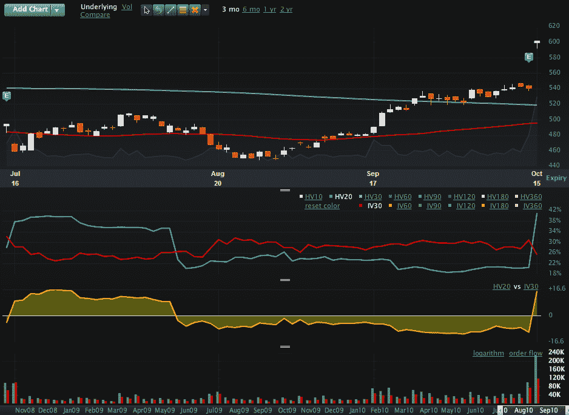

<!--yml
category: 未分类
date: 2024-05-18 17:01:05
-->

# VIX and More: Chart of the Week: The Google Volatility Story

> 来源：[http://vixandmore.blogspot.com/2010/10/chart-of-week-google-volatility-story.html#0001-01-01](http://vixandmore.blogspot.com/2010/10/chart-of-week-google-volatility-story.html#0001-01-01)

If there is one widely accepted tenet of volatility that my wife refuses to give in to, it is that when a stock falls sharply its [implied volatility](http://vixandmore.blogspot.com/search/label/implied%20volatility) almost automatically increases, yet when that same stock jumps sharply, its implied volatility almost automatically decreases. Volatility should be directionally agnostic, she insists, whether it is implied volatility or historical volatility.

In the case of stocks, a balanced bi-directional view of volatility rarely prevails. The main reasons for asymmetric volatility expectations have to do with the beliefs that are associated with extreme price movements. The old aphorism, “Stocks take the stairs up, but the elevator down” has some statistical support and for most traders, considerable confirmation in terms of personal experience. Said another way, when something positive happens to a company, it rarely creates a virtuous cycle that lifts its stock price skyward. On the other hand, when things go bad, the dominoes have a habit of lining up in such a way as to create a vicious cycle of bad news, which some investors have dubbed the “[cockroach theory](http://www.investopedia.com/terms/c/cockroach-theory.asp)” due to the fact that there never seems to be just one cockroach.

Partly as a result of elevators, cockroaches and personal experience, most equity options demonstrate a negative volatility [skew](http://vixandmore.blogspot.com/search/label/skew) (also known as a reverse skew or “volatility smirk”) in which out of the money puts have substantially higher implied volatility than out of the money calls.

This week’s [chart of the week](http://vixandmore.blogspot.com/search/label/chart%20of%20the%20week) shows the curious phenomenon that my wife takes issue with. Specifically, Google’s ([GOOG](http://vixandmore.blogspot.com/search/label/GOOG)) stock price jumped 11% on Friday following a very strong earnings report. As the chart below shows, historical or realized volatility jumped dramatically (20-day historical volatility almost doubled from 21 to 41,) while implied volatility fell sharply (30-day implied volatility dropped from 30.24 to 25.35.)

With Google’s earnings out of the way, clearly some [event volatility](http://vixandmore.blogspot.com/search/label/event%20volatility) was removed from the stock’s immediate outlook, but did Friday’s 60 point jump in the stock prices really make it less susceptible to future volatility. That is what the data would have us believe…

Related posts:

*[source: Livevol Pro]*

***Disclosure(s):*** *Livevol* *is an advertiser on VIX and More*