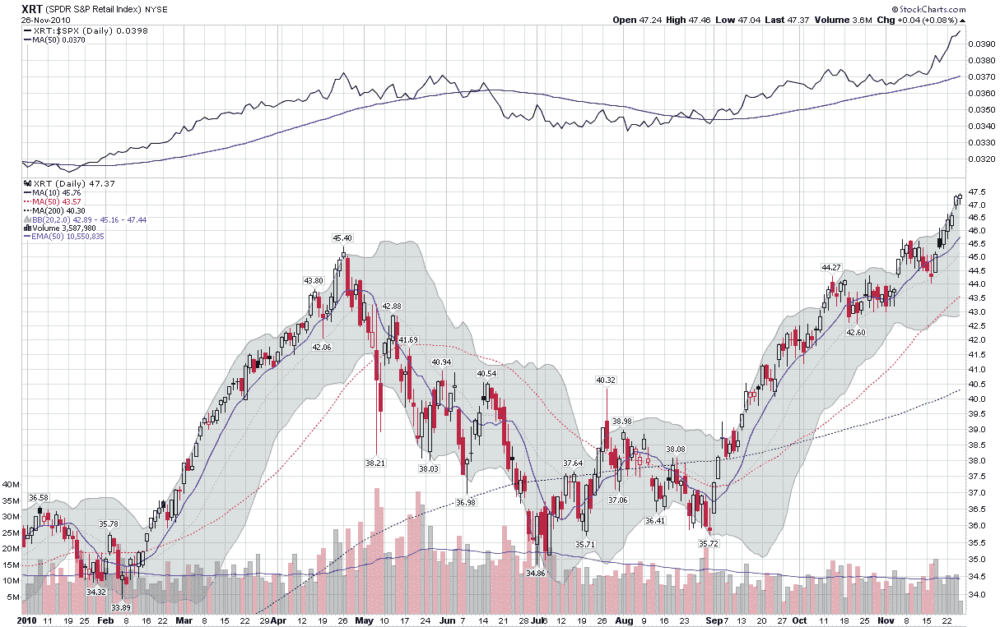

<!--yml
category: 未分类
date: 2024-05-18 16:58:00
-->

# VIX and More: Chart of the Week: The Resurgent Consumer and Holiday Shopping

> 来源：[http://vixandmore.blogspot.com/2010/11/chart-of-week-resurgent-consumer-and.html#0001-01-01](http://vixandmore.blogspot.com/2010/11/chart-of-week-resurgent-consumer-and.html#0001-01-01)

During the first half of 2010, a recovery in manufacturing helped to lift stocks. When manufacturing plateaued, stocks gave up their gains. Now it looks like manufacturing may be picking up again, but it has been consumer spending that has been responsible for much of the recent rise in equities.

There are two large ETFs devoted to retailers, [XLY](http://vixandmore.blogspot.com/search/label/XLY) and [XRT](http://vixandmore.blogspot.com/search/label/XRT). While neither is a great proxy for the types of stores most likely to compete for our holiday shopping dollars, they will both pick up the major trends. I tend to have a slight preference for XRT over because XRT has more holding and these are more equally distributed. The top holding for XLY, for instance, is McDonalds ([MCD](http://vixandmore.blogspot.com/search/label/MCD)).

In this week’s [chart of the week](http://vixandmore.blogspot.com/search/label/chart%20of%20the%20week) below, I show the performance of XRT over the course of 2010\. Note that earlier in the month XRT broke above its April high and has continued to maintain a bullish trajectory since then. Of particularly interest is the sector’s performance relative to the S&P 500 index (top study), which has been very strong since stocks began to rally in the beginning of September.

With the holiday shopping season off to a good start, XRT makes an intriguing momentum play and should be a barometer of the strength of U.S. consumer throughout the holiday season.

Related posts:

*

*[source: StockCharts.com]*

****Disclosure(s):*** *none***