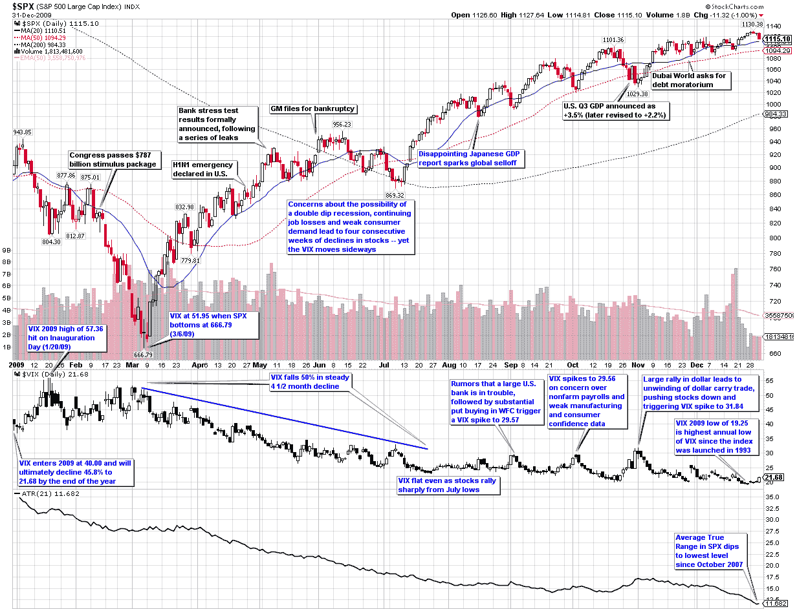

<!--yml
category: 未分类
date: 2024-05-18 17:18:30
-->

# VIX and More: Chart of the Week: The VIX and Volatility in 2009

> 来源：[http://vixandmore.blogspot.com/2010/01/chart-of-week-vix-and-volatility-in.html#0001-01-01](http://vixandmore.blogspot.com/2010/01/chart-of-week-vix-and-volatility-in.html#0001-01-01)

In this week’s [chart of the week](http://vixandmore.blogspot.com/search/label/chart%20of%20the%20week), I take a look back at the entire year as seen through the eyes of the VIX and volatility. The first thing you see in this heavily annotated chart is that while the graph of the S&P 500 index for the year looks like a checkmark (a dip down to the March lows followed by a rally), volatility as measured by both the VIX and the [average true range](http://vixandmore.blogspot.com/search/label/average%20true%20range) of the SPX declined in almost a straight line over the course of the year. In other words, volatility was much less sensitive to market declines in 2009 than it had been in prior years.

Similarly, whereas the VIX peaked at 89.53 in October 2008, it was five months later before the SPX finally found a bottom. Part of the explanation for mean reversion in the VIX leading [mean reversion](http://vixandmore.blogspot.com/search/label/mean%20reversion) in the SPX is likely due to [behavioral finance](http://vixandmore.blogspot.com/search/label/behavioral%20finance) factors such as those I described in [Availability Bias and Disaster Imprinting](http://vixandmore.blogspot.com/2009/11/availability-bias-and-disaster.html).

Even with the less responsive VIX in 2009, the full year ended up with the second highest mean VIX for the year (31.48, behind 2008’s record of 32.68) and the highest annual low for the VIX (19.25) since the VIX was launched in 1993.

The chart shows some of the major events on the volatility landscape over the course of the year, as well as other events (black text) that had a limited impact on volatility. Notably absent from the second half of the year is any sort of sustained rise in volatility. Instead, volatility events were short-lived and with one exception, not able to push the VIX over 30\. I find it interesting that while rumors of a large U.S. bank in trouble or even the Dubai debt crisis failed to elevate the VIX above 30, the one event that did push the VIX above 30 was more of a trading event (a reversal in the dollar carry trade) than an economic or geopolitical threat to stocks.

For a similar recap of the year in volatility from 2008, readers are encouraged to check out:

*[source: StockCharts]*

 ****Disclosure:*** *none**