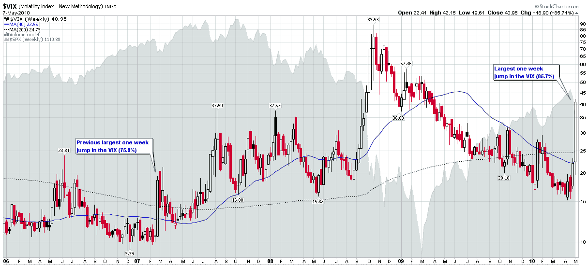

<!--yml
category: 未分类
date: 2024-05-18 17:10:38
-->

# VIX and More: Chart of the Week: The Weekly VIX

> 来源：[http://vixandmore.blogspot.com/2010/05/chart-of-week-weekly-vix.html#0001-01-01](http://vixandmore.blogspot.com/2010/05/chart-of-week-weekly-vix.html#0001-01-01)

There were so many fascinating developments in the financial markets during the week, that it is difficult to single one chart out as this week’s [chart of the week](http://vixandmore.blogspot.com/search/label/chart%20of%20the%20week). As this blog has the VIX in the title, however, it seems sacrilegious to potentially overlook the fact that the [VIX spiked](http://vixandmore.blogspot.com/search/label/VIX%20spikes) more last week than in the entire history of the VIX, even including reconstructed VIX data going back to the beginning of 1990\. The 85.7% jump in the VIX last week easily surpassed the previous record of 75.9%, which was from the week of [February 27, 2007](http://vixandmore.blogspot.com/search/label/February%2027), when the Shanghai Stock Exchange composite index fell 8.8% in one day.

The chart below captures weekly bars of the VIX going back to the beginning of 2006\. The chart highlights the fact that most VIX spikes are a 2-3 week phenomenon. As I see it, the record VIX spike of September-November 2008 is the type of extended VIX spike one only expects to encounter every two or three generations.

The difficulty in dismissing the current crisis is that as volatility has a tendency to cluster, so do financial crises. For example, the [Asian financial crisis](http://vixandmore.blogspot.com/search/label/Asian%20financial%20crisis) of 1997 helped to sow the seeds for the [Russian financial crisis](http://vixandmore.blogspot.com/search/label/Russian%20financial%20crisis) and [Long-Term Capital Management](http://vixandmore.blogspot.com/search/label/Long%20Term%20Capital%20Management) crisis of 1998\. Several years later, the 2000-2002 bear market in technology stocks – and the government response – helped to sow the seeds for the housing bubble that began as the 2007 [subprime mortgage](http://vixandmore.blogspot.com/search/label/subprime%20mortgage) crisis and eventually blossomed into the 2008 financial crisis. The current European sovereign debt crisis certainly has many of its roots in the crises of 2007 and 2008.

So while I do not expect the VIX to remain over 40 in the days and weeks ahead, I am aware that the current crisis will leave deep economic and pschological scars on the landscape that will take months and years to heal in full. More importantly, the governmental response to the current European sovereign debt crisis could easily extend the cycle of current volatility or send ripples through history that will amplify the effects of future financial crises.

When it comes to the VIX and volatility, watching history in the making is typically gut wrenching and expensive, with very few spectators able to enjoy the entertainment value of new records.

For more on related subjects, readers are encouraged to check out:

*[source: StockCharts.com]*

***Disclosure(s):*** *short VIX at time of writing*