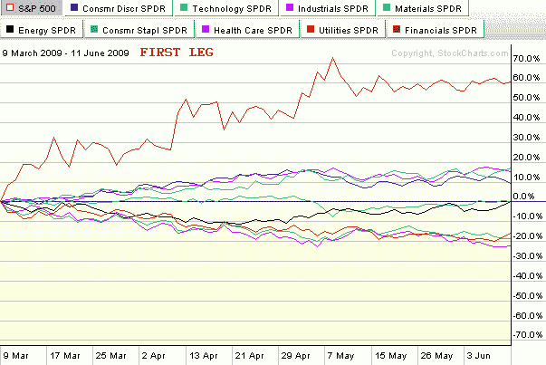
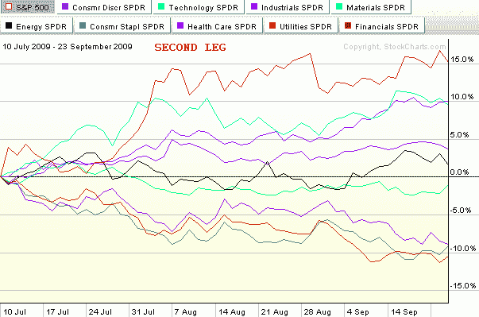
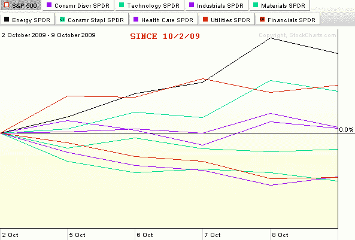

<!--yml
category: 未分类
date: 2024-05-18 17:26:57
-->

# VIX and More: Chart of the Week: Two Bull Legs and Counting…

> 来源：[http://vixandmore.blogspot.com/2009/10/chart-of-week-two-bull-legs-and.html#0001-01-01](http://vixandmore.blogspot.com/2009/10/chart-of-week-two-bull-legs-and.html#0001-01-01)

In the seven months since stocks bottomed and rallied some 61% (in the SPX) to current levels, there have been two distinct bull legs. The first leg began with the low close on March 9^(th) (or intraday low on March 6^(th)) and lasted just a little more than three months until the high close on June 11^(th). After a one month downturn, the second bull leg was launched on July 10^(th) and persisted almost two and one half months until September 23^(rd). This time the pullback appears to have been more short-lived and has a provisional end date of October 2^(nd).

The three charts below – which collectively form this week's [chart of the week](http://vixandmore.blogspot.com/search/label/chart%20of%20the%20week) – capture the sector performance relative to the SPX (the numbers are not in absolute terms) for the first two bull legs and also throws in the first week of what may turn out to be a third bull leg.

Note that in the first two bull legs, financials ([XLF](http://vixandmore.blogspot.com/search/label/XLF)) were easily the top performing sector in both instances. Also, on both occasions it was the materials ([XLB](http://vixandmore.blogspot.com/search/label/XLB)) and industrial ([XLI](http://vixandmore.blogspot.com/search/label/XLI)) sectors that had clear separation from the rest of the sectors and were almost neck and neck for second and third. These three sectors clearly represent a top tier in terms of performance during the most pronounced 2009 bull moves. A second tier of consumer discretionary ([XLY](http://vixandmore.blogspot.com/search/label/XLY)), technology ([XLK](http://vixandmore.blogspot.com/search/label/XLK)) and energy stocks ([XLE](http://vixandmore.blogspot.com/search/label/XLE)) has generally performed slightly above the baseline SPX. The bottom tier consists of three defensive sectors that typically only outperform the SPX in market downturns. In fact, these three sectors, health care ([XLV](http://vixandmore.blogspot.com/search/label/XLV)), consumer staples ([XLP](http://vixandmore.blogspot.com/search/label/XLP)) and utilities ([XLU](http://vixandmore.blogspot.com/search/label/XLU)), were the top three performers during the June 11^(th) to July 10^(th) pullback.

Just for fun, I have added the last week of performance in the bottom chart. It is too early to draw conclusions for one week of upward movement, but so far the leading sector for October is energy. If the markets are to continue to set new highs for 2009, a big question will be whether the same sectors continue to lead or whether new leadership emerges. Personally, I do not expect that the same performance hierarchy that has characterized the last two bull legs to continue during the next month or two of upward moves. In fact, I would expect leadership to shift to the second tier in the form of technology, energy or consumer discretionary stocks. No matter what happens, it will be interesting to see how the broader market performs if financials start to lag the other sectors.

*[source: StockCharts]*