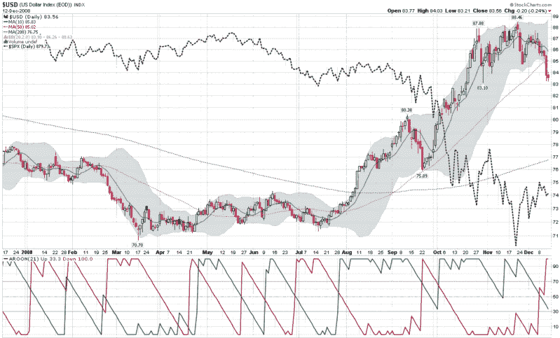

<!--yml
category: 未分类
date: 2024-05-18 18:11:11
-->

# VIX and More: Chart of the Week: U.S. Dollar Reverses Down

> 来源：[http://vixandmore.blogspot.com/2008/12/chart-of-week-us-dollar-reverses-down.html#0001-01-01](http://vixandmore.blogspot.com/2008/12/chart-of-week-us-dollar-reverses-down.html#0001-01-01)

There were many strong candidates for the [chart of the week](http://vixandmore.blogspot.com/search/label/chart%20of%20the%20week), but this week’s honor goes to the U.S. [Dollar](http://vixandmore.blogspot.com/search/label/dollar), which saw its largest one week drop in percentage terms in at least 25 years.

As the chart below shows, the dollar has been negatively correlated to stocks for the past five months or so. Historically, a falling dollar has generally not been positive for stocks. It will, however, provide some support for exporters and enhance demand for commodities that are quoted in dollars across the globe.

For the most part, the strength of the dollar usually reflects traders’ opinions about the strength of the U.S. economy relative to economies associated with the other major [currencies](http://vixandmore.blogspot.com/search/label/currencies). When the dollar was rising, therefore, it was not necessarily a vote of confidence in the U.S. economy as much as it reflected a concern that other nations may be in an even more difficult situation. Now with the mushrooming U.S. debt on top of an already severe economic crisis, the prospects for the U.S. economy relative to that of some of other global economies is being reevaluated from one of the strongest to perhaps only slightly better than average.

The dollar appreciated approximately 23% from July to November. This week the dollar moved below its 50 day moving average for the first time since the July bullish move again. Trend indicators such as the [Aroon](http://www.investopedia.com/articles/trading/06/Aroon.asp) are starting to reflect a reversal in trend; expect trend-following systems to be short the dollar as the new trend becomes more pronounced.

Do not be surprised to see half of the 23% gain disappear in the next few months.

*[source: StockCharts, VIX and More]*