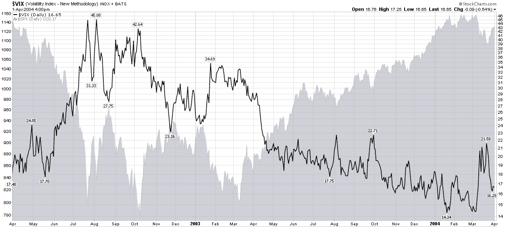

<!--yml
category: 未分类
date: 2024-05-18 17:13:28
-->

# VIX and More: Chart of the Week: VIX After 2002 Bottom

> 来源：[http://vixandmore.blogspot.com/2010/03/chart-of-week-vix-after-2002-bottom.html#0001-01-01](http://vixandmore.blogspot.com/2010/03/chart-of-week-vix-after-2002-bottom.html#0001-01-01)

With all the comments I have heard about the persistent falling volatility, one would think that the drop in the VIX to below the 17.00 level is an unwarranted aberration. Several factors suggest otherwise.

Perhaps the most impressive statistical evidence in support of a low VIX is the level of 20 day historical volatility in the SPX, which ended the week at 9.10, following a close of 8.68 on Thursday. While it is true that for the course of its history the VIX has generally been higher than historical volatility in the SPX, the average premium is about 35%, not the unusually high 86% from Friday.

In addition to the statistical evidence, it is also helpful to place the current rally off of a bottom in historical context. In the [chart of the week](http://vixandmore.blogspot.com/search/label/chart%20of%20the%20week) below, which examines the [2002](http://vixandmore.blogspot.com/search/label/2002) low, one can see the VIX spiking over 42.00 just as the SPX was bottoming in early October 2002\. Some 12 ½ months later, the middle of October 2003, the VIX was hovering in the mid-16s, on the way to a low of about 16.00 by the end of the month and an eventual cycle low in the 14s some 3 ½ months later.

As stocks are now also 12 ½ months away from their March 2009 lows, a VIX in the 16s should not be a surprise, particularly given historical volatility levels, which are generally lower now than they were in October 2003.

As much as I think a lower VIX is possible, my personal forecast is for the VIX to have difficulty gaining traction below the 16.00 level, at least during the April options expiration cycle.

For more on related subjects, readers are encouraged to check out:

*[source: StockCharts]* 

***Disclosure(s):*** *none*