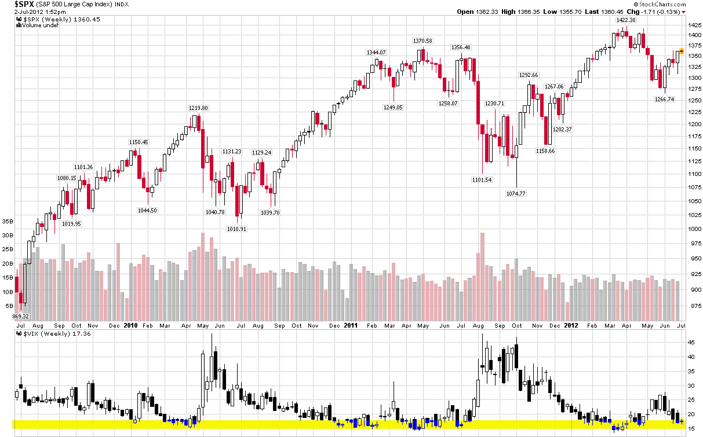

<!--yml
category: 未分类
date: 2024-05-18 16:27:07
-->

# VIX and More: Chart of the Week: VIX Reversal Signal Coming Soon?

> 来源：[http://vixandmore.blogspot.com/2012/07/chart-of-week-vix-reversal-signal.html#0001-01-01](http://vixandmore.blogspot.com/2012/07/chart-of-week-vix-reversal-signal.html#0001-01-01)

Sometimes the simplest ways to analyze the VIX are the best.

The [chart of the week](http://vixandmore.blogspot.com/search/label/chart%20of%20the%20week) below shows weekly bars of the S&P 500 index and the VIX going back three years. In the VIX study at the bottom, I have also highlighted in yellow the zone from 15-18, which has proven to be a fairly robust zone of support for the VIX during this period. Note that while the VIX has slipped below 15 on occasion, it has eventually bounced off of this support level in each instance and, perhaps more notably, a [VIX bottom](http://vixandmore.blogspot.com/search/label/VIX%20bottom) in the 15-18 range has also coincided with a top in the SPX each time around.

With the VIX in the low 17s as I type this, bulls and bears alike should be on the lookout for signs of a bottom forming in the VIX – and be prepared to position their portfolios accordingly.

Related posts:

**

*[source(s): StockCharts.com]*

***Disclosure(s):*** *none*