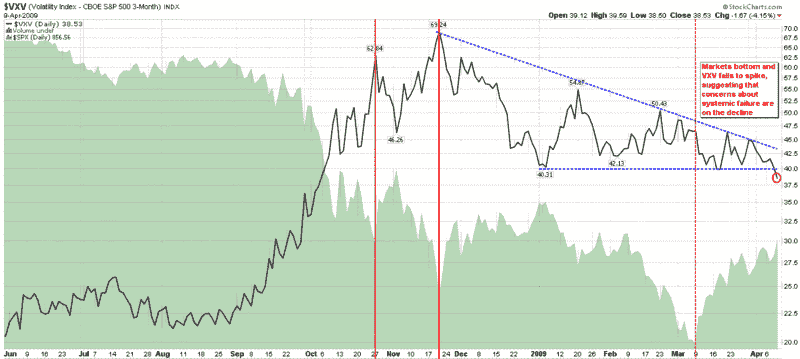

<!--yml
category: 未分类
date: 2024-05-18 17:52:29
-->

# VIX and More: Chart of the Week: VXV and Systemic Failure

> 来源：[http://vixandmore.blogspot.com/2009/04/chart-of-week-vxv-and-systemic-failure.html#0001-01-01](http://vixandmore.blogspot.com/2009/04/chart-of-week-vxv-and-systemic-failure.html#0001-01-01)

When it comes to the [chart of the week](http://vixandmore.blogspot.com/search/label/chart%20of%20the%20week), anything goes. Now it its six month, this regular feature can highlight anything from an important economic data release to interest rates, bonds, index performance, market internals and even my strange and unusual ratios. My intent has been to keep volatility in the loop, but generally cast a wide net each week.

This week I am focusing on volatility, but probably not a measure that many readers pay attention. Specifically, I am speaking of the [VXV](http://vixandmore.blogspot.com/search/label/VXV). This index is essentially a 93 day version of the VIX, but for those who are interested in further digging, a good place to start is with my December 2007 [Thinking About the VXV](http://vixandmore.blogspot.com/2007/12/thinking-about-vxv.html).

One reason I think the VXV is worth following is that I believe it gives a better perspective on [structural volatility](http://vixandmore.blogspot.com/search/label/structural%20volatility) and systemic risk than its short-term counterpart, the VIX. For more on this subject, I encourage readers to check out my November 20, 2008 post, [The VXV and Extreme Structural Volatility Risk](http://vixandmore.blogspot.com/2008/11/vxv-and-extreme-structural-volatility.html).

All this brings us to the chart below. The quick takeaway is that according to the VXV, structural volatility and systemic risk peaked on November 29^(th) and has been in a decline ever since, as the dotted blue [descending triangle](http://vixandmore.blogspot.com/search/label/descending%20triangle) reflects. I have also included three vertical red lines to show significant market bottoms. The first two generated significant VXV spikes and were eventually violated. The most recent bottom, which resulted in the SPX hitting 666, is shown with a dashed vertical red line. An important feature of that bottom is that the VXV did not spike, suggesting that there was no increase in systemic risk – perhaps part of the reason why the 666 bottom has held.

Finally, note that as of Friday (red circle), the VXV has dropped to levels not seen since the first week in October. The key takeaway: systemic healing is continuing and the risk of systemic failure is diminishing. When the VXV is able to make it back below 30, I suspect this will be an indication that systemic risk is once again at a manageable level.

*[source: StockCharts]*