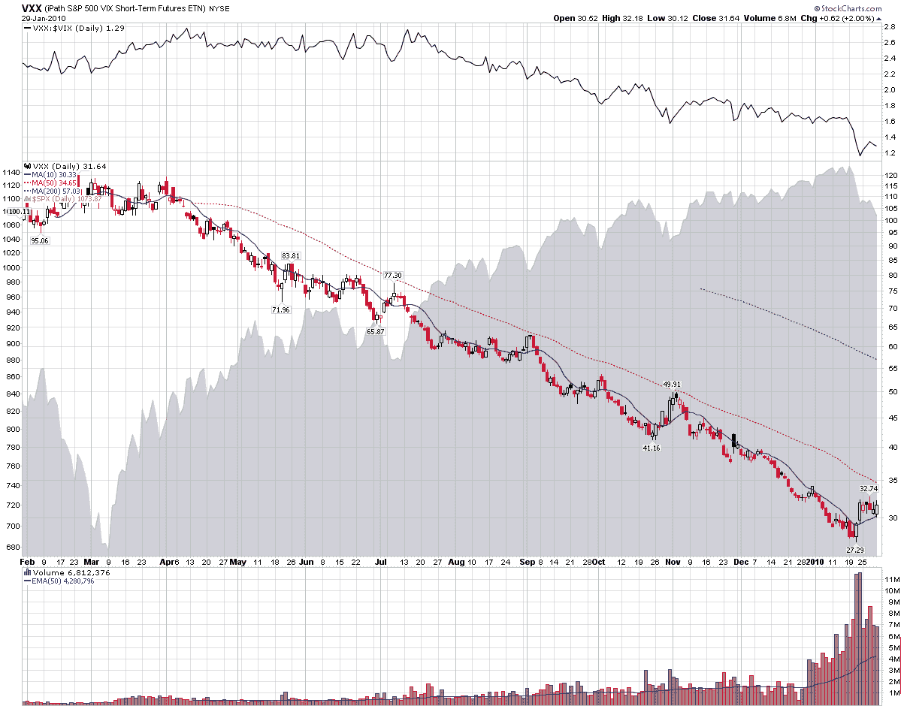

<!--yml
category: 未分类
date: 2024-05-18 17:16:39
-->

# VIX and More: Chart of the Week: VXX Celebrates One Year of Futility

> 来源：[http://vixandmore.blogspot.com/2010/01/chart-of-week-vxx-celebrates-one-year.html#0001-01-01](http://vixandmore.blogspot.com/2010/01/chart-of-week-vxx-celebrates-one-year.html#0001-01-01)

One year ago yesterday, the iPath S&P 500 VIX Short-Term Futures (1 month) ETN ([VXX](http://vixandmore.blogspot.com/search/label/VXX)) was rolled out to little fanfare, with the exception of the [widespread coverage](http://vixandmore.blogspot.com/2009/01/first-day-of-trading-in-vxx-and-vxz.html) that VXX and sibling [VXZ](http://vixandmore.blogspot.com/search/label/VXX) received here when the ETNs were launched.

VXX opened at 100.11 that day, with the VIX at 42\. 63\. One year later, VXX is down 68.4% and the VIX is down 42.2%.

Setting aside leveraged ETFs, long positions in VXX were by far the best way to lose money in an ETF over the course of the last year. Putting the 68.4% loss in VXX in perspective, there were only two other ETFs in which investors could have lost 50% of their investment: short financials ([SEF](http://vixandmore.blogspot.com/search/label/SEF)), which were down 52%; and short emerging markets ([EUM](http://vixandmore.blogspot.com/search/label/EUM)), which fell 50%. Long natural gas ([UNG](http://vixandmore.blogspot.com/search/label/UNG)) and short base metals ([BOS](http://vixandmore.blogspot.com/search/label/BOS)) would both have resulted in losses of 48%.

This week’s [chart of the week](http://vixandmore.blogspot.com/search/label/chart%20of%20the%20week) captures the VXX in all its futility, with a ratio of VXX to the VIX on top to see how VXX has underperformed the cash/spot volatility index throughout the past year.

The links below explain the manner in which negative [roll yield](http://vixandmore.blogspot.com/search/label/roll%20yield) and other factors have caused VXX to underperform the VIX and turn in such as disastrous performance. All things considered, I expect VXX to perform better relative to the VIX in its second year than it did in its first year, though admittedly this is not a very high bar to clear.

For more on how VXX is constructed and performs, readers are encouraged to check out:

 *[source: StockCharts]* 

***Disclosures:*** *short VXX at time of writing*