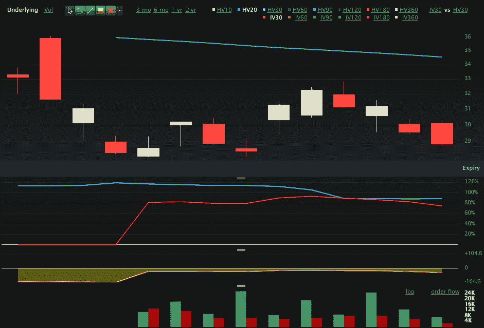

<!--yml
category: 未分类
date: 2024-05-18 17:08:15
-->

# VIX and More: Chart of the Week: VXX Options

> 来源：[http://vixandmore.blogspot.com/2010/06/chart-of-week-vxx-options.html#0001-01-01](http://vixandmore.blogspot.com/2010/06/chart-of-week-vxx-options.html#0001-01-01)

Launched just two weeks ago, [VXX options](http://vixandmore.blogspot.com/search/label/VXX%20options) have already attracted a great deal of interest, averaging approximately 17,000 contracts traded per day. While this number is impressive for such a short period of time, it still pales when compared to the 260,000 or so contracts in VIX options that are traded on a typical day.

As the chart of the week below (which uses [VXX](http://vixandmore.blogspot.com/search/label/VXX) data from May 23 to the present) shows, VXX call volume has been running at about twice the rate of VXX put volume. It is far too early to determine whether VXX options data may flag smart money or dumb money, but it is worth noting at this juncture that the biggest spike in VXX call volume (green bars at bottom) preceded a nice jump in VXX. On the other hand, the second biggest single day volume in VXX calls came last Wednesday, the day before the SPX jumped 3.0% and caused volatility to plummet.

Going forward, I am likely to make VXX options a favorite topic in this space, particularly as VXX options can be used in combination with the underlying, the VXX ETN.

For more on related subjects, readers are encouraged to check out:

*[source: Livevol Pro]*

***Disclosures:*** *short VXX at time of writing*