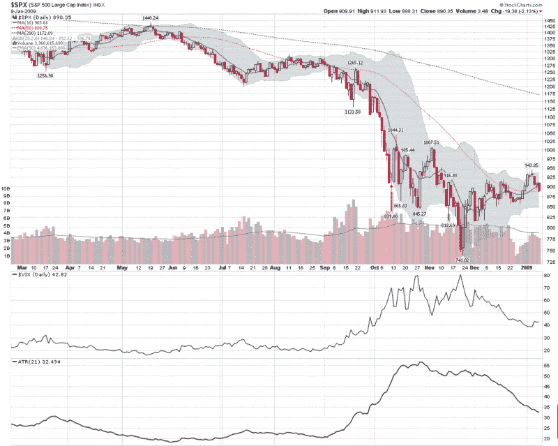

<!--yml
category: 未分类
date: 2024-05-18 18:06:48
-->

# VIX and More: Chart of the Week: Volatility Drifts Lower

> 来源：[http://vixandmore.blogspot.com/2009/01/chart-of-week-volatility-drifts-lower.html#0001-01-01](http://vixandmore.blogspot.com/2009/01/chart-of-week-volatility-drifts-lower.html#0001-01-01)

While stocks gave back some gains this week and any sense of inevitability was stricken from the consciousness of the bulls, volatility only grudgingly began to reappear on the charts.

In fact, if you look at the [chart of the week](http://vixandmore.blogspot.com/search/label/chart%20of%20the%20week) below, you see more concern about future volatility in the form of the VIX than there are indications of rising current volatility, as reflected in the [average true range](http://vixandmore.blogspot.com/search/label/average%20true%20range) (ATR) of the S&P 500 index. I elected to use the 21 day setting for the ATR, as it is based on trading days and approximates the 30 calendar day time horizon used by the VIX. For the record, shortening the ATR window to 10 days shows the same pattern of declining volatility. The SPX [historical volatility](http://vixandmore.blogspot.com/search/label/historical%20volatility) picture is similarly calm, with 20 day historical volatility hovering around 31 at the moment.

Even with the markets selling off this week, volatility remains relatively low, at least as measured by post-Lehman standards.

*[source: StockCharts]*