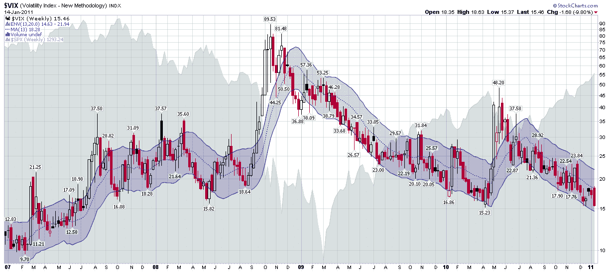

<!--yml
category: 未分类
date: 2024-05-18 16:54:03
-->

# VIX and More: Chart of the Week: the VIX Since 2007

> 来源：[http://vixandmore.blogspot.com/2011/01/chart-of-week-vix-since-2007.html#0001-01-01](http://vixandmore.blogspot.com/2011/01/chart-of-week-vix-since-2007.html#0001-01-01)

[The Year in VIX and Volatility](http://vixandmore.blogspot.com/2011/01/year-in-vix-and-volatility-2010.html) was such a huge hit two weeks ago that I thought it would be appropriate to address all the angst about low readings in the VIX with a chart of the CBOE Volatility Index (yes, the VIX does have a formal name) that stretches back to the beginning of 2007 and incorporates the 2007 peak in stocks, the 2008 panic, the 2009 bottom and the rally that has dominated the past two years.

Whereas the majority of the charts in this space use daily VIX bars and an occasional chart of [VIX macro cycles](http://vixandmore.blogspot.com/search/label/VIX%20macro%20cycles) and the like utilize monthly bars, this time around I am pulling back to a perspective which utilized weekly bars for the VIX. Personally, I like weekly bars because it removes the weekend effect or ‘[calendar reversion](http://vixandmore.blogspot.com/search/label/calendar%20reversion)’ as I like to call it. More importantly, I plan my trading and execute my strategies in weekly time chunks, hence the weekly [subscriber newsletter](http://vixandmoresubscriber.blogspot.com/).

The chart below, courtesy of StockCharts.com, is the first I recall ever having seen that uses weekly [moving average envelopes](http://vixandmore.blogspot.com/search/label/moving%20average%20envelopes) (MAEs) for the VIX. In this particular variation, I have used MAEs that cover 13 weeks (one quarter) of VIX data and plotted an envelope which extends 20% above and below that 13-week moving average. The result is a chart which does a good job of capturing outliers that are generally high probability fade trades.

The chart also shows that a break below the 15.00 level will but the VIX back at a level not seen since July 2007, which is, ironically, just about the time that [Adam Warner](http://www.dailyoptionsreport.com/) and I had the bright idea to estimate where volatility was going to be. *[See [Volatility Aces Bloggers](http://vixandmore.blogspot.com/2007/07/volatility-aces-bloggers.html) for the gory details.]*

Getting back to the moving average envelopes, current VIX levels are relatively low in absolute terms, but with the bottom of the weekly 13-20 moving average envelope currently at 14.63, the risk of the VIX punching through the lower envelope appears to be extremely low, at least to this observer.

My best guess is that the next piercing of the envelope is more likely to be associated with a rising VIX than a falling one, but even that scenario may take a while to play out.

Related posts:

*[source: StockCharts.com]*

***Disclosure(s):*** *none*